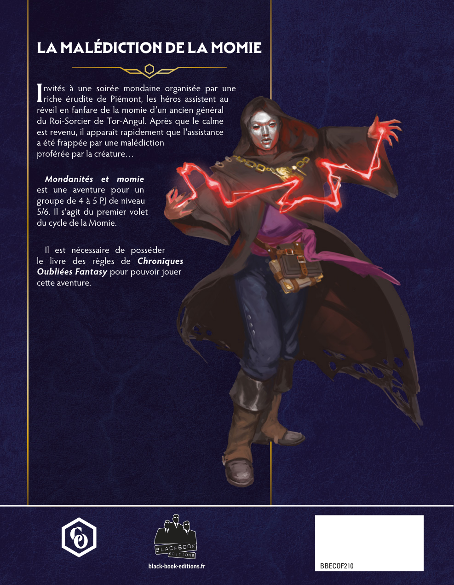
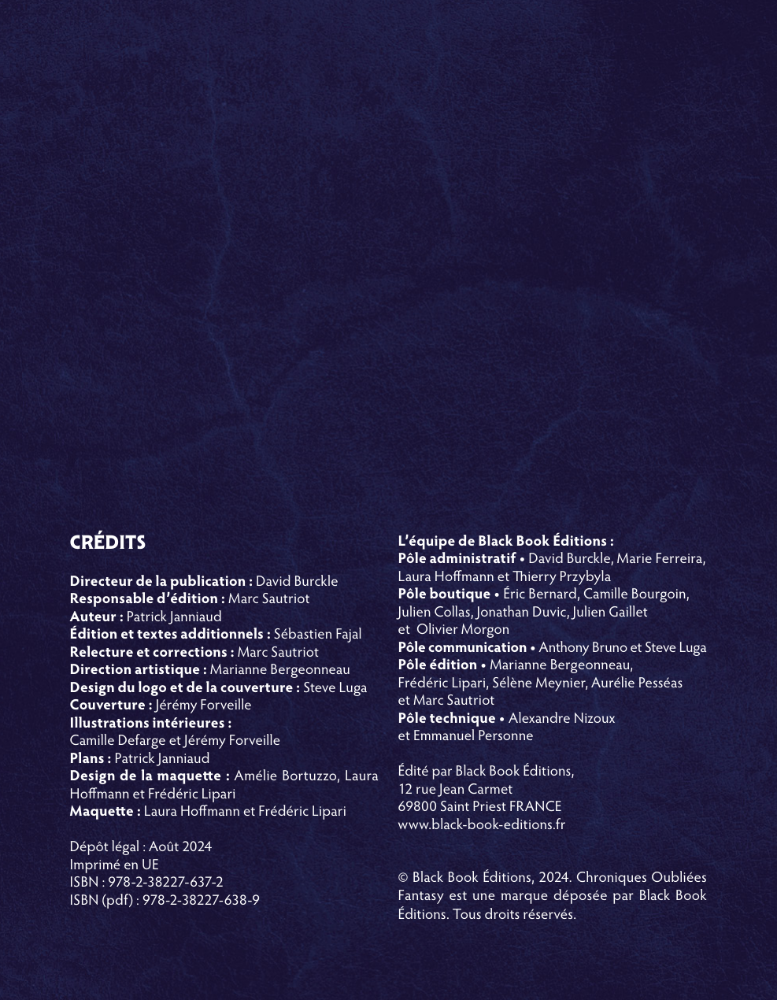
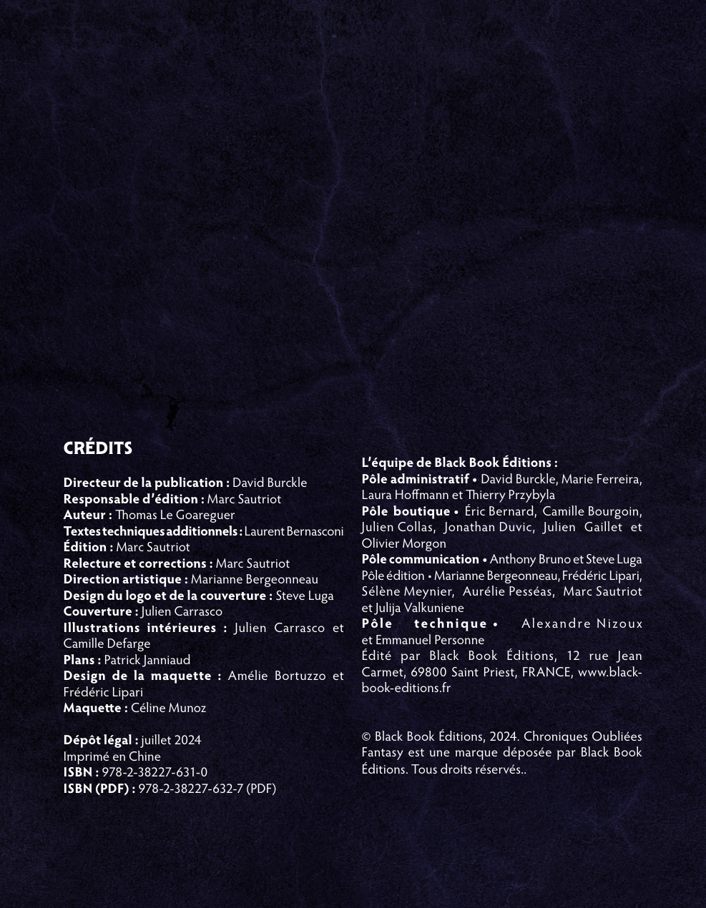
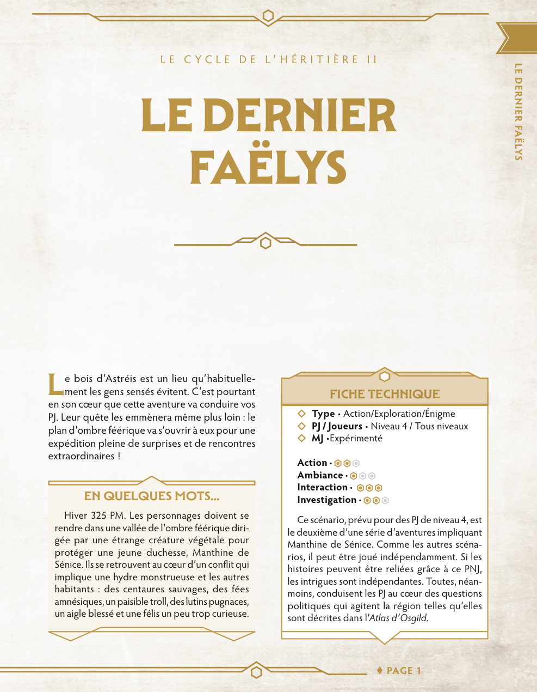
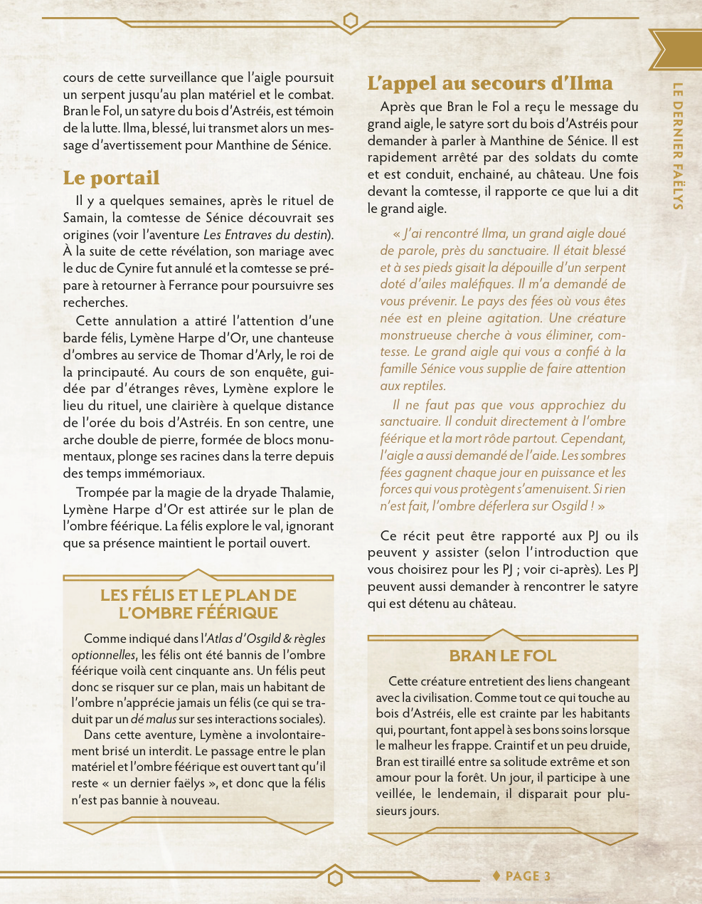
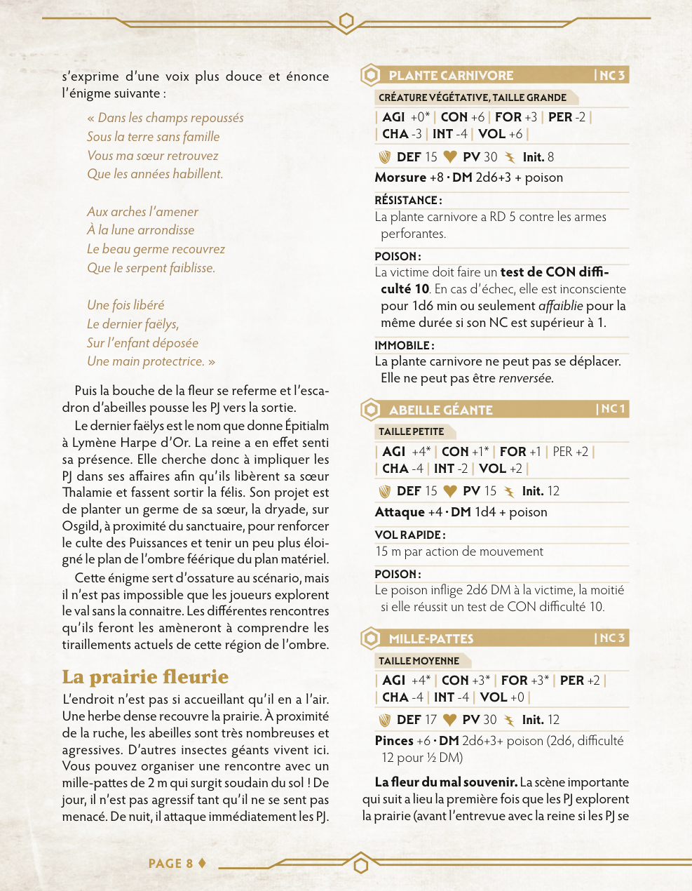
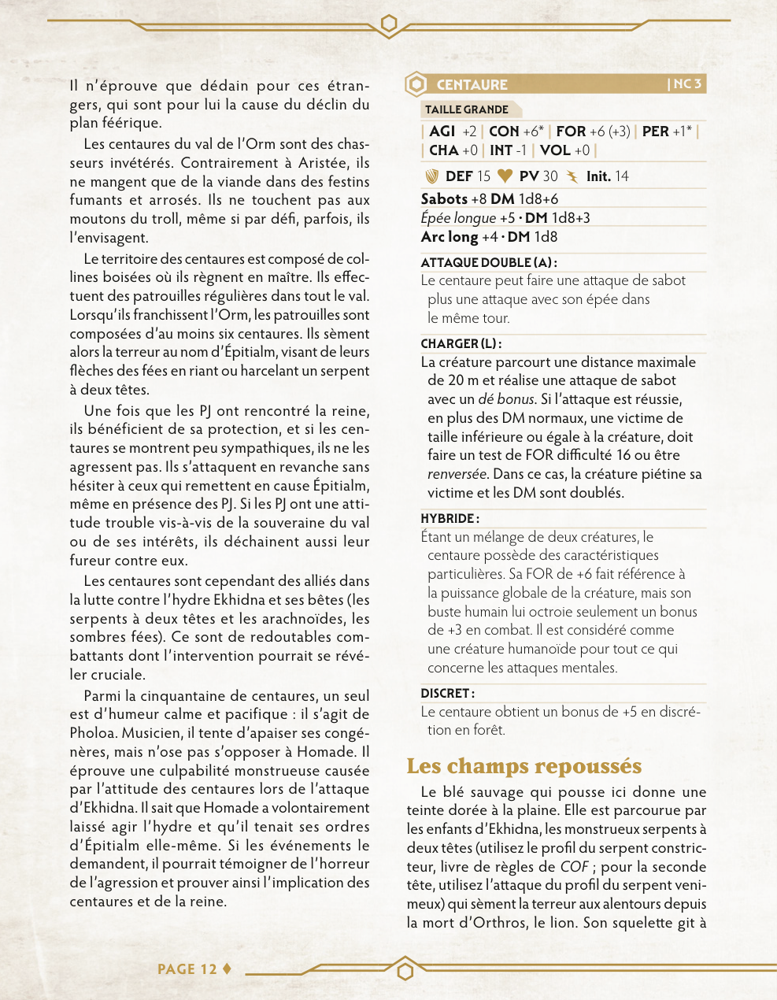
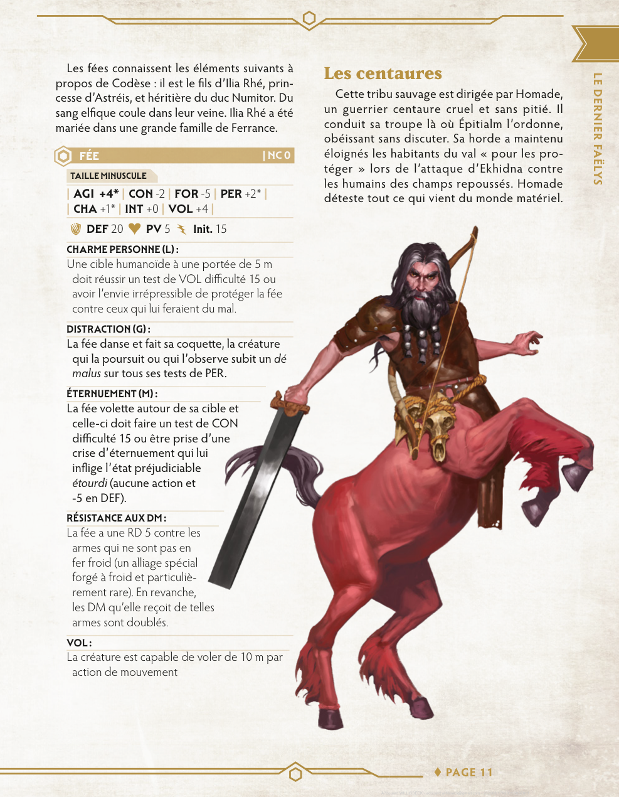
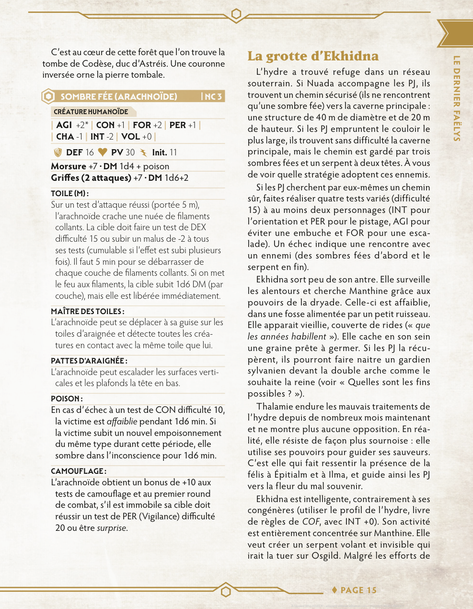
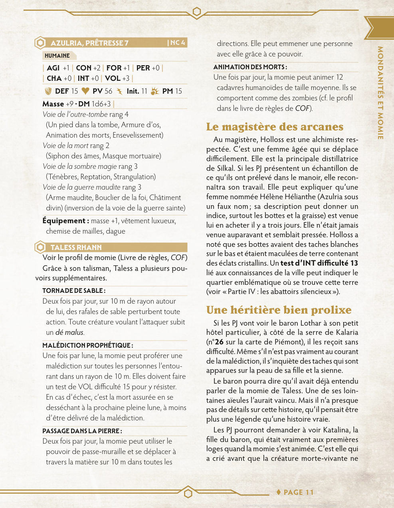

# Audit ingestion COF2 — comparaison PDF / base de données

**Date initiale :** 2026-06-18  
**Re-vérification :** 2026-06-18 (ré-import des deux PDF après corrections supposées)

| Campagne | Document ID | Run | PDF source |
|----------|-------------|-----|------------|
| `momie` | `doc_010672301b36` | `run_6969a3c32c0f` | `COF2_10_Mondanites_Et_Momies_web_v1a.pdf` |
| `dernier-faelys` | `doc_9890af687cf9` | `run_b82a587edb2a` | `COF2_07_Le_Dernier_Faelys_web_v0.pdf` |

**État en base :** ingestion `completed` pour les deux documents (20 pages chacun).

| Métrique | Momie (avant → après) | Faelys |
|----------|----------------------|--------|
| Chunks | 75 → **40** | **49** |
| Sections | — → **39** | **41** |
| Fiches COF2 | 2 | 7 |

---

## Synthèse de la re-vérification

Sur les **7 erreurs du premier audit**, **aucune n'est entièrement corrigée**. Le nombre de chunks a fortement baissé sur Momie (moins de duplication globale), et une section CRÉDITS distincte existe désormais — mais les fusions pages non contiguës, la hiérarchie de sections Faelys et le parseur de capacités COF2 restent problématiques.

**3 nouvelles erreurs significatives** ont été identifiées (fusion p. 10→12 sautant la p. 11, fragment orphelin MILLE-PATTES, texte centaures rattaché à la mauvaise section).

### Bilan des 7 cas initiaux

| # | Problème | Statut |
|---|----------|--------|
| 1 | Momie — synopsis + crédits fusionnés | **Partiel** — section CRÉDITS + chunk dédié, mais le synopsis garde les crédits BBE |
| 2 | Faelys — crédits + intro fusionnés | **Ouvert** |
| 3 | Faelys — titre section tronqué p. 7 | **Ouvert** (aggravé : encadré éclaté en 3 sections) |
| 4 | Faelys — 11 sections mal rattachées | **Ouvert** |
| 5 | Faelys — CENTAURE capacités manquantes | **Ouvert** (`abilities[]` incomplet) |
| 6 | Faelys — FÉE capacités manquantes | **Ouvert** |
| 7 | Faelys — SOMBRE FÉE capacités manquantes | **Ouvert** |

### Ce qui est correct

| Élément | Momie | Faelys |
|---------|-------|--------|
| Fiches détectées | AZULRIA (NC 4), TALESS RHANN (4 capacités + renvoi momie) | 7 fiches, NC/attributs OK pour PLANTE CARNIVORE, ABEILLE GÉANTE, MILLE-PATTES (hors troncature) |
| Pas de doublon Taless | ✓ | — |
| Renvois livre de règles | Taless → profil momie | Fleurs gardiennes → serpent constricteur |
| Texte narratif (hors erreurs) | Sections et chunks alignés sur l'essentiel | Idem |

---

## Erreurs initiales — détail

### 1. Momie — Crédits encore présents dans le chunk d'intro (p. 2 + p. 4)

**Sévérité : haute** — statut : **partiellement corrigé**

Le chunk `chunk_doc_010672301b36_002_001` (section « LA MALÉDICTION DE LA MOMIE ») mélange toujours le synopsis (p. 2) avec la partie droite des crédits éditoriaux (p. 4 : équipe BBE + copyright).

**Amélioration :** une section `CRÉDITS` et un chunk `chunk_doc_010672301b36_004_002` isolent désormais la colonne gauche des crédits (rôles, ISBN). Les crédits restent toutefois **dupliqués** dans le chunk d'intro.

- **En base (intro) :** se termine par « L'équipe de Black Book Éditions… Tous droits réservés. »
- **En base (CRÉDITS) :** colonne gauche complète sans l'équipe BBE
- **Dans le PDF :** p. 2 = synopsis seul ; p. 4 = page CRÉDITS distincte

---

### 2. Faelys — Crédits + intro fusionnés (p. 4 + p. 5)

**Sévérité : haute** — statut : **non corrigé**

Le chunk `chunk_doc_9890af687cf9_004_003` (section « CRÉDITS ») regroupe toujours les crédits (p. 4) et le paragraphe d'intro « Le bois d'Astréis… » (p. 5). Du bruit de couverture (« LE CYCLE DE L'HÉRITIÈRE… ») apparaît en fin de chunk.

---

### 3. Faelys — Titre d'encadré mal extrait (p. 7)

**Sévérité : moyenne** — statut : **non corrigé** (aggravé)

L'encadré PDF **« LES FÉLIS ET LE PLAN DE L'OMBRE FÉÉRIQUE »** est éclaté en trois sections distinctes :

| Section en base | Titre |
|-----------------|-------|
| `sec_1d4b87b7d7ec` | `LES FÉLIS ET LE PLAN DE` |
| `sec_f2f54a64b17c` | `Le portail` (titre de colonne voisin, pas l'encadré) |
| `sec_e278166951a0` | `L'OMBRE FÉÉRIQUE` |

Le contenu de l'encadré est dans `chunk_doc_9890af687cf9_007_010` (section `L'OMBRE FÉÉRIQUE`), mais la structure est incorrecte.

---

### 4. Faelys — Hiérarchie de sections incorrecte (p. 12–19)

**Sévérité : moyenne** — statut : **non corrigé**

11 sections de zones géographiques restent rattachées comme enfants de « IMPLICATION DES PJ » (p. 8) :

- La prairie fleurie (p. 12)
- Les collines aux fées, Traverser l'Orm (p. 14)
- Les centaures, Les champs repoussés (p. 15–16)
- La forêt de lumière, Manthine (p. 17)
- La forêt des sombres fées, La vallée des champignons, Le nid des aigles, Le pic des griffons (p. 18)
- La grotte d'Ekhidna (p. 19)

Exemple : « La prairie fleurie » (`sec_f801b77a8fff`) a `parent_section_id = sec_04eb40a607c8` (IMPLICATION DES PJ, p. 8).

---

### 5. Faelys — CENTAURE : capacités manquantes dans `abilities[]` (p. 16)

**Sévérité : haute** — statut : **non corrigé**

| PDF | `abilities[]` en base | Texte brut du chunk |
|-----|----------------------|---------------------|
| ATTAQUE DOUBLE, CHARGER, HYBRIDE, DISCRET | HYBRIDE, DISCRET | les 4 présentes |

Le texte intégral est extrait ; seul le découpage structuré tronque les deux premières capacités.

---

### 6. Faelys — FÉE : capacités manquantes dans `abilities[]` (p. 15)

**Sévérité : haute** — statut : **non corrigé**

| PDF | `abilities[]` | Texte brut |
|-----|---------------|------------|
| CHARME PERSONNE, DISTRACTION, ÉTERNUEMENT, RÉSISTANCE AUX DM, VOL | RÉSISTANCE AUX DM, VOL | les 5 présentes |

---

### 7. Faelys — SOMBRE FÉE (ARACHNOÏDE) : capacités manquantes (p. 19)

**Sévérité : haute** — statut : **non corrigé**

| PDF | `abilities[]` | Texte brut |
|-----|---------------|------------|
| TOILE, MAÎTRE DES TOILES, PATTES D'ARAIGNÉE, POISON, CAMOUFLAGE | MAÎTRE DES TOILES, POISON, CAMOUFLAGE | les 5 présentes |

Manquent dans `abilities[]` : **TOILE** et **PATTES D'ARAIGNÉE**.

---

## Nouvelles erreurs identifiées

### 8. Faelys — Chunk p. 10 → p. 12 sautant la p. 11

**Sévérité : haute**

Le chunk `chunk_doc_9890af687cf9_010_020` (section « Le palais des fleurs de la reine Épitialm ») fusionne :

- **p. 10** : description du palais (début de section)
- **p. 12** : suite de l'entrevue avec Épitialm (énigme, explication du scénario)

La **p. 11 entière est absente** du chunk (contenu intermédiaire de l'entrevue avec la reine). Le texte commence par la description du palais puis saute directement à « s'exprime d'une voix plus douce et énonce l'énigme suivante ».

---

### 9. Faelys — MILLE-PATTES : fiche tronquée + fragment orphelin (p. 12)

**Sévérité : moyenne**

La fiche MILLE-PATTES est coupée entre deux chunks :

- `chunk_doc_9890af687cf9_012_023` : se termine par « …poison (2d6, difficulté »
- `chunk_doc_9890af687cf9_012_024` : fragment isolé « 12 pour ½ DM) » (classé `lore`, pas `stat_block`)

---

### 10. Faelys — Texte « Les centaures » rattaché à « Les champs repoussés » (p. 16)

**Sévérité : moyenne**

Le long texte narratif sur les centaures (colonne gauche p. 16) est stocké dans `chunk_doc_9890af687cf9_016_033`, rattaché à la section **« Les champs repoussés »** (`sec_6be78be81fcb`) au lieu de **« Les centaures »** (`sec_d511ed1c94b0`). La section « Les centaures » ne contient que l'intro Homade (`015_031`) et la fiche (`016_032`).

---

### Référence — Momie p. 15 : fiches cohérentes

AZULRIA et TALESS RHANN sont correctement extraites (NC, attributs, capacités Taless, renvoi livre de règles).

---

## Anomalies mineures (non bloquantes)

- Titres de couverture dupliqués sur 2 lignes — cosmétique.
- AZULRIA : les **voies** de prêtresse dans le texte brut mais pas dans `abilities[]` — comportement attendu (voies ≠ capacités nommées).
- Chunk Faelys `004_003` : artefact de couverture en fin de texte (« LE CYCLE DE L'HÉRITIÈRE… »).
- Section Faelys « EN QUELQUES MOTS… » (niveau 3) rattachée comme enfant de « CRÉDITS » — hiérarchie discutable.
- Momie : chunk « Les grandes lignes » span p. 5–7 — acceptable (même section continue après saut de page).

---

## Liste récapitulative

| # | Document | Type | Page(s) | Statut re-audit |
|---|----------|------|---------|-----------------|
| 1 | Momie | Chunk mélange synopsis + crédits | 2, 4 | Partiel |
| 2 | Faelys | Chunk mélange crédits + intro | 4, 5 | Ouvert |
| 3 | Faelys | Encadré titre éclaté / tronqué | 7 | Ouvert |
| 4 | Faelys | 11 sections mal rattachées | 12–19 | Ouvert |
| 5 | Faelys | CENTAURE — 2 capacités manquantes dans `abilities[]` | 16 | Ouvert |
| 6 | Faelys | FÉE — 3 capacités manquantes | 15 | Ouvert |
| 7 | Faelys | SOMBRE FÉE — 2 capacités manquantes | 19 | Ouvert |
| 8 | Faelys | Chunk fusionne p. 10 + p. 12, saute p. 11 | 10–12 | **Nouveau** |
| 9 | Faelys | MILLE-PATTES tronqué + fragment orphelin | 12 | **Nouveau** |
| 10 | Faelys | Texte centaures dans mauvaise section | 16 | **Nouveau** |

---

## Pistes de correction

1. **Chunking** : ne pas fusionner des blocs de pages non contiguës (couverture/crédits vs narratif ; p. 10 vs p. 12). Couper les chunks à chaque saut de page non adjacent.
2. **Sections** : détecter les encadrés multi-lignes comme une seule section ; réinitialiser la pile de parents quand une section H1 se termine avant des H2 tardifs (zones géographiques Faelys).
3. **Fiches COF2** (`packages/ingest/src/rpg_ingest/raw/stat_blocks/cof2.py`) : le parseur `abilities[]` tronque les capacités en tête de fiche (CENTAURE, FÉE, SOMBRE FÉE) alors que le texte brut est complet — investiguer la regex / limite de tokens.
4. **Colonnes** : sur p. 16 Faelys, associer le texte de la colonne gauche à la section dont le titre précède dans la même colonne (« Les centaures », pas « Les champs repoussés »).
