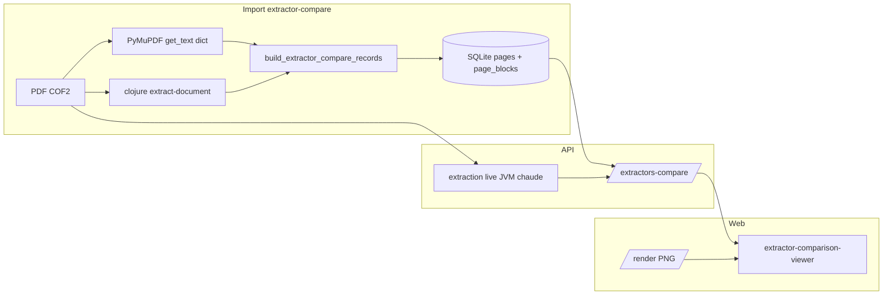

# Plan : comparateur PyMuPDF vs PDFBox (Clojure)

## Objectif

Boucle de feedback pour affiner la pipeline Clojure/PDFBox en comparant côte à côte l'extraction **PyMuPDF raw** et **PDFBox** sur les mêmes pages PDF :

```
PDF → [PyMuPDF raw + PDFBox Clojure] → SQLite (2 lanes) → comparateur Web → itération heuristiques Clojure
```

Ce plan est **complémentaire** de `docs/plan-layout-viewer.md` (visualiseur layout PyMuPDF seul).

## Branche et PR

- Branche de travail : `cursor/clojure-raw-ingest-375c`
- PR ouverte : [#25](https://github.com/Yutsa/rpg-assistant/pull/25) (draft)
- Derniers commits notables :
  - `3b4d010` — mode `extractor-compare` + persistance BDD
  - `505931d` — merge `main` (suppression Docling conservée)
  - `0f485fa` — fixes Bugbot (filtre lanes `/nodes`, compare sans PDF, zoom, stderr Clojure)

## Architecture



### Modèle de données

| Élément | Détail |
|---------|--------|
| Mode ingest | `--ingest-mode extractor-compare` |
| `PageRecord.extraction_method` | `"extractor_compare"` |
| IDs blocs | `{lane}_{doc_id}_{page:04d}_{idx:04d}` via `compare_block_id()` |
| Metadata bloc | `compare_lane: "pymupdf" \| "pdfbox"` |
| Tables | `pages`, `page_blocks` uniquement (pas sections/chunks) |

### Lecture comparateur

1. API tente **BDD** si les deux lanes sont présentes (`compare_page_extractors_from_db`).
2. Sinon **fallback live** (JVM Clojure chaude + PyMuPDF).
3. PDF source **non requis** si données déjà en BDD.

### Layout viewer vs comparateur

- `/nodes` (layout viewer) : filtre **PyMuPDF uniquement** quand des `compare_lane` existent (évite doublons).
- `/extractors-compare` : renvoie **les deux lanes**.

## Phases

### Phase 1 — Import BDD ✅ (livré)

**Backend Python**

- `packages/ingest/src/rpg_ingest/raw/extractor_compare_ingest.py` — extraction des 2 lanes + records
- `packages/ingest/src/rpg_ingest/raw/clojure_pdfbox.py` — bridge Clojure (JVM chaude page, CLI document entier)
- `packages/ingest/src/rpg_ingest/raw/importer.py` — `_persist_extractor_compare`, branche `INGEST_MODE_EXTRACTOR_COMPARE`
- `packages/core/src/rpg_core/storage/ids.py` — `compare_block_id()`
- CLI : `rpg-ingest raw extract … --ingest-mode extractor-compare`

**Backend Clojure**

- `raw extract-document --pdf PATH` — batch toutes les pages
- `raw extract-page --pdf PATH --page N` — une page
- `serve` — JVM chaude (stdin/stdout JSON)
- Heuristique colonnes : split par **gaps horizontaux** adaptatifs (`page.clj`)

**API**

- `GET /documents/{id}/pages/{n}/extractors-compare` — BDD prioritaire, PDF optionnel

**Tests**

- `tests/test_extractor_compare_ingest.py`
- `tests/test_extractor_compare_api.py`

**Commande de référence (momie)**

```bash
uv run rpg-ingest raw extract \
  data/pdfs/COF2_10_Mondanites_Et_Momies_web_v1a.pdf \
  --campaign-id momie \
  --ingest-mode extractor-compare
```

Exemple résultat : 20 pages, ~238 blocs PyMuPDF, ~1093 blocs PDFBox. Page 7 : 11 vs 92 blocs.

### Phase 2 — Comparateur interactif 🔲 (prochaine session)

**État actuel Web** (`extractor-comparison-viewer`)

- Deux panneaux PyMuPDF / PDFBox avec overlay SVG
- Tooltip au survol (`<title>`) — **pas de clic**
- Pas de surbrillance croisée entre panneaux
- Pas de panneau détail bloc

**À implémenter** (s'inspirer de `page-layout-viewer`)

- [ ] Clic sur un bloc → sélection + panneau détail (texte, bbox, metadata)
- [ ] Hover / sélection avec classes CSS (`is-hovered`, `is-selected`)
- [ ] Optionnel : lien visuel bloc PyMuPDF ↔ bloc PDFBox le plus proche (bbox overlap / distance)
- [ ] Réutiliser zoom du layout viewer si pertinent (`displayWidth = containerWidth × zoom`)
- [ ] Prefetch pages adjacentes déjà en place côté API client

**Fichiers cibles**

- `apps/web/src/app/shared/components/extractor-comparison-viewer/extractor-pane.component.*`
- `apps/web/src/app/shared/components/extractor-comparison-viewer/extractor-comparison-viewer.component.*`

### Phase 3 — Affinage pipeline Clojure 🔲

Boucle manuelle page par page :

1. Import `extractor-compare` (ou relancer après changement code Clojure)
2. Ouvrir comparateur sur page piège (ex. page 7 momie — 2 colonnes)
3. Ajuster heuristiques dans `packages/ingest-clj/src/rpg/ingest/extract/page.clj`
4. **Relancer l'import** `extractor-compare` pour rafraîchir la BDD  
   *(ou fallback live si API relancée avec JVM chaude — mais BDD stale sinon)*

**Pistes heuristiques ouvertes**

- Titres centrés / gutter model pour colonnes (ne pas couper au milieu)
- Pages illustration (peu de glyphes) — pas de sur-segmentation
- Fusion lignes adjacentes même colonne
- Regroupement blocs multi-lignes (paragraphes)

**Tests Clojure**

```bash
cd packages/ingest-clj && clojure -M:test
```

Régression page 7 momie si PDF présent dans `data/pdfs/`.

## Campagne de référence

| Clé | Valeur |
|-----|--------|
| `campaign_id` | `momie` |
| PDF | `data/pdfs/COF2_10_Mondanites_Et_Momies_web_v1a.pdf` |
| `document_id` (après import compare) | `doc_a3cfad8c9253` (hash-contenu ; peut varier) |
| Page piège colonnes | **7** |

## Points d'attention

| Sujet | Détail |
|-------|--------|
| Import legacy ≠ compare | Un import `full` ou `layout-only` ne remplit pas les deux lanes |
| JVM chaude | Après modif Clojure, **relancer l'API** pour le fallback live |
| BDD à jour | Après modif Clojure, **réimporter** `extractor-compare` pour le comparateur BDD |
| Clojure stderr | `stderr=DEVNULL` sur `serve` (évite pipe plein) |
| Suppression Docling | Conservée depuis `main` — provider unique `legacy` |

## Dette / hors scope immédiat

- Tests COF2 chunking (`provider=` obsolète sur `run_real_pdf_benchmark`) — régression post-#24 sur `main`, pas liée au comparateur
- MCP `import_pdf` : pas encore de mode `extractor-compare` (CLI seulement)
- Champ `source` dans la réponse API compare (interne Python, pas exposé au schéma OpenAPI)

## Critères de succès globaux

- [x] Import CLI persiste PyMuPDF + PDFBox en BDD
- [x] API compare lit BDD sans PDF obligatoire
- [x] Overlay deux panneaux dans la webapp
- [ ] Clic / détail bloc dans le comparateur
- [ ] Page 7 momie : PDFBox ≈ découpage colonnes cohérent avec le visuel PDF
- [ ] Documentation heuristiques validées reproductible via tests Clojure

## Références code

| Rôle | Chemin |
|------|--------|
| Import compare | `packages/ingest/src/rpg_ingest/raw/extractor_compare_ingest.py` |
| Importer | `packages/ingest/src/rpg_ingest/raw/importer.py` |
| Bridge Clojure | `packages/ingest/src/rpg_ingest/raw/clojure_pdfbox.py` |
| Compare API/logic | `packages/ingest/src/rpg_ingest/feedback/extractor_compare.py` |
| Router API | `packages/api/src/rpg_api/routers/pages.py` |
| Heuristiques PDFBox | `packages/ingest-clj/src/rpg/ingest/extract/page.clj` |
| Viewer Web | `apps/web/src/app/shared/components/extractor-comparison-viewer/` |
| Layout viewer (modèle UX) | `apps/web/src/app/shared/components/page-layout-viewer/` |
