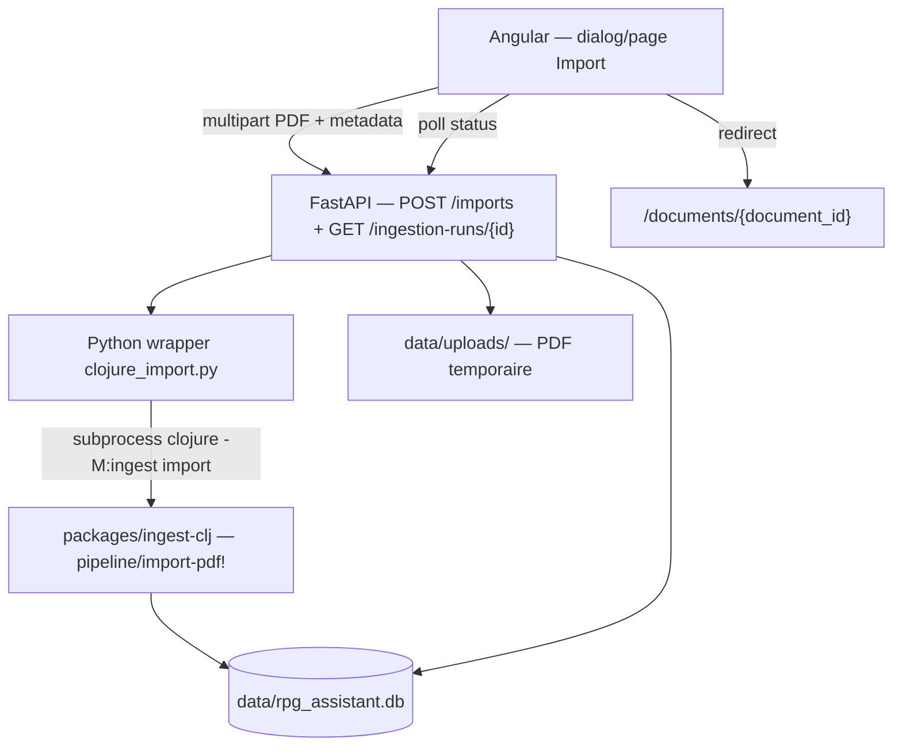

# Plan : import de campagne depuis le frontend (pipeline Clojure)

## Contexte et objectif

Aujourd'hui, les campagnes arrivent dans l'application par des chemins **hors UI** :

| Canal | Pipeline | Exemple |
|-------|----------|---------|
| Bootstrap cloud | Python (`rpg-ingest`) | `seed-campaigns.sh` |
| Dev / réimport | **Clojure PDFBox** | `clojure-import-momie.sh` |
| Agents MCP | Python | `import_pdf` |

Le frontend Angular (`CampaignListPage`) est **100 % lecture seule** : il liste les campagnes via `GET /api/campaigns` et affiche déjà le message « Importez un PDF pour commencer » sans action associée. L'API FastAPI n'expose que des **GET**.

**Objectif** : permettre à l'utilisateur d'importer un PDF depuis le navigateur, en passant par la **pipeline Clojure** (`clojure -M:ingest import` → `pipeline/import-pdf!`), avec retour visuel (progression, erreurs, navigation vers le document ingéré).

---

## Architecture cible



**Principe** : l'API reste en Python (cohérent avec le monorepo actuel) ; elle **orchestre** la pipeline Clojure existante, sans la réécrire. Le schéma SQLite et les modèles `rpg-core` restent inchangés.

---

## Décisions techniques à trancher

| Sujet | Recommandation | Alternative |
|-------|----------------|-------------|
| **Exécution import** | Tâche **background** FastAPI + polling | Import synchrone (bloque 1–2 min, timeout HTTP) |
| **Wrapper Clojure** | Nouveau module `clojure_import.py` (miroir de `clojure_pdfbox.py`) | Appel direct subprocess depuis le router |
| **Upload** | `multipart/form-data` → `data/uploads/{uuid}.pdf` | Chemin serveur pré-existant (dev only) |
| **Création campagne** | Créée automatiquement par `ensure-campaign!` (déjà dans la pipeline) | `POST /campaigns` séparé |
| **Réimport même PDF** | `reimport=true` par défaut (comportement CLI actuel) | Case à cocher « Écraser si existant » |
| **Pipeline par défaut** | Clojure uniquement pour ce flux UI | Choix Python/Clojure (complexité inutile) |
| **Limite taille** | ~50 Mo (PDF COF2 ≈ 5–15 Mo) | Configurable via env |

---

## Phase 1 — Pont Python → Clojure import

**But** : encapsuler l'appel CLI dans `rpg-ingest`, réutilisable par l'API et les tests.

### Fichiers

| Fichier | Action |
|---------|--------|
| `packages/ingest/src/rpg_ingest/raw/clojure_import.py` | **Nouveau** — `run_clojure_import(pdf_path, campaign_id, …) → ImportResult` |
| `packages/ingest/src/rpg_ingest/raw/clojure_pdfbox.py` | Factoriser `_clojure_subprocess_env()`, `_INGEST_CLJ_DIR` dans un module commun |
| `tests/test_clojure_import.py` | Test d'intégration (skip si Java/Clojure absent ; actif sur cloud agent) |

### Comportement du wrapper

```python
# Pseudo-contrat
def run_clojure_import(
    pdf_path: Path,
    *,
    campaign_id: str,
    campaign_title: str = "",
    game_system: str = "cof2",
    db_path: Path | None = None,
    coverage_threshold: float = 0.3,
    reimport: bool = True,
    timeout_s: int = 600,
) -> ClojureImportResult:
    # subprocess: clojure -M:ingest import --pdf … --campaign-id … [--game-system cof2] [--db …]
    # parse stdout JSON (snake_case, aligné cli.clj)
    # lever ImportError si status rejected/failed ou stderr non vide
```

**Réutiliser** :

- Résolution `JAVA_HOME` de `clojure_pdfbox.py`
- Format JSON de sortie de `import-command` dans `cli.clj` (`ingestion_run_id`, `campaign_id`, `document_id`, `status`, `stats`, `error_message`)
- Modèle `IngestionRunRecord` / lecture via `RawRepository.get_ingestion_run()` pour validation post-run

### Critères de done

- `uv run python -m pytest tests/test_clojure_import.py` passe sur un petit PDF synthétique
- Échec propre si couverture insuffisante (`status: rejected`)
- Timeout explicite avec message d'erreur

---

## Phase 2 — Endpoints API

**But** : exposer l'import et le suivi de statut en REST.

### Nouveau router

`packages/api/src/rpg_api/routers/imports.py`

| Méthode | Path | Rôle |
|---------|------|------|
| `POST` | `/imports` | Upload PDF + lancer import Clojure (async) |
| `GET` | `/ingestion-runs/{ingestion_run_id}` | Statut + stats (miroir MCP `get_ingestion_status`) |

Optionnel en v1 :

- `POST /campaigns/{campaign_id}/imports` — même chose mais `campaign_id` imposé par l'URL
- `GET /imports/{id}` — alias si on crée une table jobs (v2)

### Schémas (`schemas.py`)

```python
class ImportCreateOut(BaseModel):
    ingestion_run_id: str
    campaign_id: str
    status: str  # "running" | "completed" | "failed" | "rejected"

class IngestionRunOut(BaseModel):
    id: str
    campaign_id: str
    document_id: str | None
    status: str
    stage: str
    stats: dict[str, Any] | None
    error_message: str | None
    started_at: datetime | None
    finished_at: datetime | None
```

### `POST /imports` — détail

**Request** (`multipart/form-data`) :

| Champ | Obligatoire | Défaut |
|-------|-------------|--------|
| `file` | oui | PDF |
| `campaign_id` | oui | slug (`momie`, `ma-campagne`) |
| `campaign_title` | non | = `campaign_id` |
| `game_system` | non | `cof2` |
| `reimport` | non | `true` |

**Flow** :

1. Valider extension/MIME, taille max
2. Sauvegarder dans `data/uploads/{uuid}_{filename_sanitized}.pdf`
3. Créer le run en base avec `status=running` **ou** lancer directement le subprocess en background
4. Retourner immédiatement `202 Accepted` + `{ ingestion_run_id, campaign_id, status: "running" }`

**Background task** (FastAPI `BackgroundTasks` ou `asyncio.create_task` + thread pool) :

- Appeler `run_clojure_import(...)`
- Mettre à jour `ingestion_runs` (déjà fait par Clojure) — pas de double écriture
- En cas d'exception subprocess : `fail-import!` équivalent côté Python ou laisser Clojure gérer

**Recommandation v1** : laisser **Clojure créer et finaliser** le run (comme le CLI). L'API ne fait que lancer le subprocess et exposer le statut via `GET`.

### `GET /ingestion-runs/{id}`

Reprendre la logique MCP (`packages/mcp/src/rpg_mcp/server.py` → `get_ingestion_status`) et mapper vers `IngestionRunOut`.

### Autres modifications API

| Fichier | Changement |
|---------|------------|
| `main.py` | `include_router(imports.router)` |
| `deps.py` | Pas de changement majeur |
| CORS | Déjà configuré pour le dev |
| Limite upload | `app.add_middleware` ou config Starlette pour body size |

### Tests

`tests/test_api_imports.py` :

- Mock `run_clojure_import` → vérifie 202 + polling GET
- Test validation (fichier absent, mauvais MIME)
- Test e2e optionnel avec vrai subprocess (marqueur `@pytest.mark.clojure`)

---

## Phase 3 — Frontend Angular

**But** : flux utilisateur complet depuis la liste des campagnes.

### Service

Étendre `apps/web/src/app/core/services/campaign-api.service.ts` :

```typescript
importPdf(formData: FormData): Observable<ImportCreateResponse>
getIngestionRun(runId: string): Observable<IngestionRun>
```

Modèles dans `campaign.models.ts` : `ImportCreateResponse`, `IngestionRun`.

### UI — composant dialog

Nouveau : `apps/web/src/app/features/campaigns/dialogs/import-campaign-dialog/`

**Champs du formulaire** :

- Fichier PDF (`input type="file"`, accept `.pdf`)
- Identifiant campagne (`campaign_id`, slug auto-généré depuis le nom de fichier)
- Titre campagne (optionnel)
- Système de jeu (`mat-select` : `cof2`, `generic`, …)
- Case « Réimporter si le PDF existe déjà »

**États** :

1. Formulaire
2. Upload + spinner « Import en cours… »
3. Polling `getIngestionRun` toutes les 2 s (max ~5 min)
4. Succès → fermer dialog + `router.navigate(['/documents', documentId])`
5. Erreur (`rejected` couverture, `failed`) → message + bouton réessayer

**Pattern réutilisable** : structure du dialog `pdf-viewer-dialog`, `EmptyStateComponent`, spinners existants.

### Points d'entrée UI

| Emplacement | Action |
|-------------|--------|
| Header `campaign-list.page.html` | Bouton « Importer un PDF » (`mat-raised-button`) |
| Empty state (aucune campagne) | Même CTA via slot/action sur `EmptyStateComponent` |
| `campaign-detail.page.html` (v2) | « Ajouter un document » à la campagne existante |

### Routing

Pas de nouvelle route obligatoire en v1 (dialog modal). Option v2 : `/campaigns/import`.

### Proxy

`proxy.conf.json` : aucun changement (`/api` → `:8000`).

### Tests e2e

`e2e/integration/campaign-import.integration.spec.ts` :

- Mock API ou import d'un petit PDF fixture
- Vérifie apparition de la campagne + navigation document

---

## Phase 4 — Stockage, sécurité, ops

| Sujet | Action |
|-------|--------|
| **Répertoire upload** | `data/uploads/` (gitignored), créé au démarrage API |
| **Nettoyage** | Supprimer le PDF uploadé après import réussi (le chemin source est dans `stats.source_pdf_path` côté Clojure — s'assurer que la pipeline pointe vers le fichier uploadé) |
| **Validation `campaign_id`** | Regex `^[a-z0-9][a-z0-9_-]{0,63}$` |
| **Concurrence** | Un seul import simultané par `document_id` (hash PDF) — message clair si conflit |
| **Env** | `RPG_UPLOAD_DIR`, `RPG_IMPORT_TIMEOUT_S`, `RPG_MAX_UPLOAD_MB` |
| **Dev stack** | Vérifier que `dev-stack.sh` a Java + Clojure disponibles (déjà le cas sur cloud agent) |

**Point d'attention** : `source_pdf_path` dans les stats doit référencer le PDF uploadé pour que le rendu de pages (`GET …/render`) fonctionne après import UI. Vérifier que `pipeline/import-pdf!` enregistre bien le chemin absolu du `--pdf` passé.

---

## Phase 5 — Alignement bootstrap et documentation

| Sujet | Action |
|-------|--------|
| **`seed-campaigns.sh`** | Hors scope v1 — reste Python pour le bootstrap rapide ; documenter que l'UI utilise Clojure |
| **`docs/plan-clojure-ingestion-full.md`** | Ajouter une sous-section « Phase 6b — Import frontend » ou lien vers ce plan |
| **`AGENTS.md`** | Documenter `POST /imports` et le flux de vérification visuelle post-import UI |
| **MCP `import_pdf`** | Hors scope v1 — pourrait migrer vers Clojure plus tard via le même wrapper |

---

## Ordre d'implémentation recommandé

1. Wrapper Python (débloque tests CLI headless)
2. Endpoints API + tests mockés
3. Service + dialog Angular
4. Bouton sur liste campagnes + empty state
5. Test e2e + capture Playwright (`capture-verification.sh` sur document importé)

---

## Critères d'acceptation (definition of done)

- [ ] Depuis `http://127.0.0.1:4200/campaigns`, l'utilisateur peut uploader un PDF COF2
- [ ] L'import passe par `clojure -M:ingest import` (vérifiable via `stats.extraction_method = "pdfbox"`)
- [ ] Progression visible (spinner + statut terminal)
- [ ] Succès → redirection vers `/documents/{document_id}` avec sections/chunks/fiches exploitables
- [ ] Échec couverture → message explicite (`rejected`)
- [ ] Tests automatisés : wrapper, API (mock), e2e minimal
- [ ] Preuve visuelle : capture du dialog + page document post-import

---

## Risques et mitigations

| Risque | Mitigation |
|--------|------------|
| Import long (1–2 min) | Background + polling ; pas de requête HTTP bloquante |
| Timeout HTTP / proxy | 202 immédiat ; poll sur endpoint léger |
| Java/Clojure absent en prod | Healthcheck étendu ou erreur 503 explicite au POST |
| PDF scanné rejeté | Message UI + lien doc sur `coverage_threshold` |
| Divergence Python (seed) vs Clojure (UI) | Documenter ; migration `seed-campaigns.sh` vers Clojure en follow-up |
| Gros PDF | Limite taille + barre de progression upload (v2) |

---

## Hors scope v1

- Import batch (plusieurs PDF)
- Couche sémantique post-import
- Migration MCP `import_pdf` vers Clojure
- Remplacement de `seed-campaigns.sh` par Clojure
- WebSocket/SSE (polling suffit pour v1)
- Authentification / multi-utilisateur
- Comparateur extracteurs depuis l'UI

---

## Estimation de complexité (technique)

| Couche | Fichiers neufs | Fichiers modifiés | Difficulté |
|--------|----------------|-------------------|------------|
| Wrapper Python | 1–2 | 1 | Faible (modèle `clojure_pdfbox.py`) |
| API | 2 | 2 | Moyenne (async, upload, validation) |
| Frontend | 3–4 | 3 | Moyenne (dialog, polling, UX) |
| Tests | 2–3 | 0 | Faible à moyenne |

La plus grosse part du travail est **l'orchestration async** et **l'UX de progression**, pas la pipeline Clojure elle-même — elle est déjà opérationnelle via le CLI.
