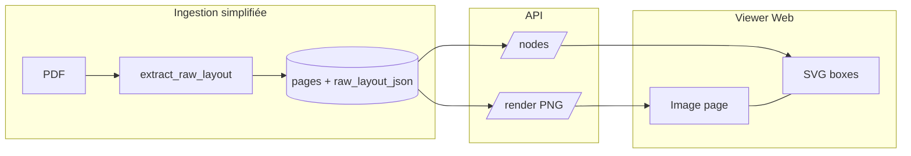

# Plan : ingestion raw PyMuPDF + visualiseur de boxes

## Objectif

Créer une boucle de feedback visuelle :

```
PDF → PyMuPDF brut → stockage fidèle → overlay Web → décisions sur les heuristiques
```

## État actuel

La pipeline dans `layout.py` ne conserve que les blocs texte (`type=0`), collapse lignes/spans en une bbox par bloc, puis applique filtrage watermark, fusion de blocs, sections, chunks et COF2.

L'API expose déjà `/render` et `/blocks` ; le frontend Angular ne les utilise pas.

## Architecture cible



## Phases

### Phase 1 — Mode `layout-only` (backend) ✅ MVP

- `extract_raw_layout_pages()` : hiérarchie complète `page.get_text("dict")` (blocs texte + image, lignes, spans)
- Colonne `pages.raw_layout_json`
- Flag `--ingest-mode layout-only` : pas de sections/chunks, pas d'heuristiques
- Mode `full` inchangé (défaut)

### Phase 2 — API nodes

- `GET /documents/{id}/pages/{n}/raw-layout`
- `GET /documents/{id}/pages/{n}/nodes?level=&type=`

### Phase 3 — Viewer Web

- Route `/documents/:documentId/pages/:pageNumber`
- PNG + overlay SVG, toggles bloc/ligne/span, hover tooltip

### Phase 4 — Itération heuristiques

Activer une heuristique à la fois, comparer overlay avant/après.

### Phase 5 — Simplification structurelle

Pipeline en étapes dérivées : `extract_raw → [transforms] → derive_sections → derive_chunks`.

## Critères de succès MVP

- [x] Importer un PDF en `layout-only` sans sections/chunks
- [x] Voir les blocs PyMuPDF superposés au PNG dans le navigateur
- [ ] Basculer bloc / ligne / span (P1)
- [ ] Décider sur 3 cas concrets quelle heuristique ajouter

## Références

- Extraction actuelle : `packages/ingest/src/rpg_ingest/raw/layout.py`
- Import : `packages/ingest/src/rpg_ingest/raw/importer.py`
- API pages : `packages/api/src/rpg_api/routers/pages.py`
