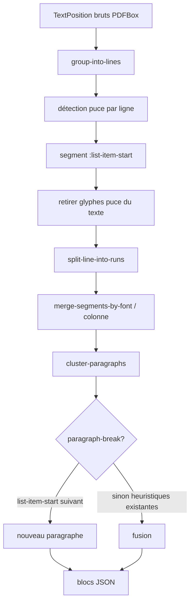

# Plan : détection des listes à puces PDFBox par layout (remplacer `chip-entry-start?`)

## Contexte

### Problème actuel

La pipeline Clojure/PDFBox (`packages/ingest-clj/src/rpg/ingest/extract/page.clj`) regroupe les `TextPosition` en paragraphes via `cluster-paragraphs` / `paragraph-break?`.

Pour les **fiches PNJ** COF2 (page 8 de *Mondanités et Momie*), le commit [#28](https://github.com/Yutsa/rpg-assistant/pull/28) a introduit deux mécanismes distincts, présentés comme un seul fix :

| Mécanisme | Rôle réel |
|-----------|-----------|
| `layout-glyph-position?` | Ignorer les glyphes Wingdings (puces visuelles) |
| `chip-entry-start?` | Forcer une coupure de paragraphe quand le texte suivant matche `^[\p{Lu}]…:` |

Le second mécanisme est un **contournement textuel** : il ne détecte pas les puces, il devine un « début de fiche » via le motif `Nom :`.

### Effets de bord observés

- **Faux positif** page 10 : `La momie a déclenché une tempête de sable :` matche `chip-entry-start?` → séparation accidentelle titre/corps de l'encadré TEMPÊTE DE SABLE (lane PDFBox).
- **Faux négatif structurel** page 11 : `LES DÉPÔTS DE GRAISSE` fusionné avec son corps (pas de `:` sur la première ligne du corps) — comportement incohérent entre encadrés.

### Constat empirique (PDFBox, page 8)

Sur une ligne de fiche PNJ (`Kalian : …`), positions brutes colonne droite :

```
x≈248–256  Wingdings (tab/null/‘)     gaps négatifs entre glyphes de puce
x≈255.9 → x≈265.0 "K"                 gap ≈ 1,1 px
x≈265+     lettres "alian…"            gaps ≈ 0,2–0,3 px (médiane inter-lettres)
```

Ligne de **continuation** (`Il est un témoin…`) : texte dès x≈265, **sans** préfixe non alphanumérique.

Le signal fiable n'est pas le `:` dans le texte, c'est le **layout** : préfixe non alnum + gap relatif + début de texte.

### Blocage pipeline actuel

```clojure
(->> text-positions
     (remove layout-glyph-position?)   ;; puces jetées AVANT analyse
     group-into-lines
     ...)
```

Une fois les Wingdings retirés, la ligne commence directement par `K` — le signal de puce est perdu.

---

## Objectif

Remplacer `chip-entry-start?` par une détection **layout-first** des débuts d'élément de liste à puce :

1. **Détecter** sur les `TextPosition` bruts : préfixe non alphanumérique (puces Wingdings ou équivalent) + gap horizontal anormal + texte.
2. **Annoter** le segment/ligne comme `:list-item-start true`.
3. **Exclure** les glyphes de puce du texte assemblé (comportement actuel conservé).
4. **Casser** le regroupement en paragraphes quand un nouveau `:list-item-start` apparaît (séparer Kalian / Hector / etc.).
5. **Supprimer** `chip-entry-start?` et sa regex.

### Hors périmètre de ce plan (session suivante)

- **Encadrés COF2** (titres gras `TEMPÊTE DE SABLE`, `LES DÉPÔTS DE GRAISSE`) : pas de puce Wingdings → règle dédiée `encadre-title?` dans `paragraph-break?` ou pré-traitement séparé. Voir section [Phase 2](#phase-2--encadrés-cof2-optionnel).

---

## Branche de travail

```
cursor/pdfbox-list-bullets-bb59
```

Base : `main`.

---

## Architecture cible



### Différence clé avec l'existant

| Étape | Aujourd'hui | Cible |
|-------|-------------|-------|
| Filtrage Wingdings | Avant `group-into-lines` | **Après** annotation sur la ligne |
| Début de fiche PNJ | Regex `chip-entry-start?` sur texte | Flag layout `:list-item-start` |
| Coupure paragraphe | `(chip-entry-start? (:text next))` | `(true (:list-item-start next))` |

---

## Phase 1 — Détection layout des puces

### 1.1 Réordonner le pipeline dans `page-blocks`

Fichier : `packages/ingest-clj/src/rpg/ingest/extract/page.clj`

```clojure
;; Ordre cible (pseudo-code)
(->> text-positions
     group-into-lines
     (map annotate-line-list-item-start)   ;; NOUVEAU : lit positions brutes incl. Wingdings
     (mapcat line->runs-drop-bullets)      ;; filtre puce + produit runs/segments
     ...
```

Ne plus appeler `(remove layout-glyph-position?)` en tête de pipeline. Le filtrage des glyphes de puce se fait **par ligne**, une fois la détection faite.

### 1.2 Heuristique `list-item-start?` (par ligne)

Entrée : séquence de `TextPosition` triés par `x` sur une même bande Y.

**Étapes :**

1. Partitionner la ligne en « préfixe » (glyphes non alphanumériques ou `layout-glyph-position?`) vs « corps » (premier glyphe alphanumérique et suite).
2. Calculer les gaps horizontaux **entre glyphes alphanumériques consécutifs** du corps → médiane `m`.
3. Mesurer le gap entre le **dernier glyphe du préfixe** et le **premier glyphe alphanumérique** → `g_prefix`.
4. La ligne est un début de liste si :
   - le préfixe est non vide (au moins un glyphe filtrable / Wingdings / non alnum) ;
   - `g_prefix > max(bullet-gap-min, k * m)` avec `k ≈ 2,5` et `bullet-gap-min ≈ 0,8` pt (à calibrer sur page 8 Momie) ;
   - le premier caractère alphanumérique du corps est une lettre (éviter chiffres seuls de numérotation parasite si besoin).

**Constantes suggérées** (à affiner en test) :

```clojure
(def ^:private bullet-gap-min 0.8)
(def ^:private bullet-gap-median-multiplier 2.5)
```

**Réutiliser** la logique existante de `gap-threshold` / `horizontal-gap` plutôt que réinventer.

### 1.3 Propagation du flag

Ajouter au map segment (créé dans `run-segment` ou équivalent) :

```clojure
:list-item-start true   ;; uniquement sur le premier segment de la ligne marquée
```

Tous les segments de continuation de la même fiche (lignes sans préfixe puce) ont `:list-item-start false` ou clé absente.

### 1.4 Filtrage des glyphes de puce

Conserver `layout-glyph-position?` et `strip-layout-glyphs`, mais appliquer **après** `list-item-start?` :

- positions identifiées comme préfixe de puce sur une ligne → exclues de `run-text` ;
- le reste du pipeline (`strip-layout-glyphs` sur PUA/contrôles) inchangé.

### 1.5 Remplacer `chip-entry-start?` dans `paragraph-break?`

```clojure
(defn- paragraph-break? [prev-segment next-segment threshold]
  (cond
    (:list-item-start next-segment) true          ;; NOUVEAU
    (hyphenated-line-end? (:text prev-segment)) false
    (mid-sentence-continuation? prev-segment next-segment) false
    (> (indent-delta prev-segment next-segment) paragraph-indent-min) true
    (> (vertical-gap prev-segment next-segment) threshold) true
    :else false))
```

Supprimer : `chip-entry-start-re`, `chip-entry-start?`, et le `(chip-entry-start? …)` dans le `cond`.

---

## Phase 1 — Tests

Fichier : `packages/ingest-clj/test/rpg/ingest/extract_test.clj`

### Conserver / adapter

`extract-page-merges-multi-line-chip-entries` (page 8 Momie) :

- [ ] `Kalian` : description multi-lignes dans **un** bloc.
- [ ] `Kalian` et `Hector Debranne` dans des blocs **distincts**.
- [ ] Idem `Taless Rhann`, `Elsirianne Horsbi`.

### Ajouter

`extract-page-list-bullets-no-chip-entry-false-positives` (pages 10–11 Momie) :

- [ ] Bloc PDFBox `TEMPÊTE DE SABLE` **séparé** du corps « La momie a déclenché… » **sans** dépendre d'un `:` dans le corps (nécessite Phase 2 encadré pour le comportement final ; en Phase 1 vérifier surtout l'**absence** de coupure **uniquement** due au `:` — le corps ne doit plus être isolé par la regex).
- [ ] Aucun bloc ne commence par un fragment coupé au `:` du milieu d'une phrase de corps.

`extract-page-list-item-start-metadata` (optionnel) :

- [ ] Premier segment d'une fiche PNJ expose `:list-item-start true` en metadata interne (si exposé dans `metadata` JSON : clé documentée).

### Non-régression

```bash
cd packages/ingest-clj && clojure -M:test
```

Tests existants à ne pas casser :

- `extract-page-merges-illustration-wrap-fragments-in-same-column` (p. 14)
- `extract-page-handles-drop-cap-paragraph` / `extract-page-momie-p5-intro-drop-cap`
- `extract-page-filters-parasite-blocks` (p. 9)
- `extract-page-splits-two-column-line-by-horizontal-gap` (p. 7)

---

## Phase 1 — Critères d'acceptation

| # | Critère | Vérification |
|---|---------|--------------|
| A1 | Plus de `chip-entry-start?` dans le code | `rg chip-entry packages/ingest-clj` → 0 |
| A2 | Fiches PNJ page 8 : 1 bloc par personnage, descriptions multi-lignes fusionnées | test existant vert |
| A3 | `La momie a déclenché une tempête de sable :` ne déclenche **plus** seule une coupure de paragraphe | test page 10 |
| A4 | Aucune régression sur drop-caps, wrap illustration, parasites, colonnes | suite de tests verte |
| A5 | Comportement visible dans le comparateur web (`/documents/.../pages/8/extractors-compare`) | manuel |

---

## Phase 2 — Encadrés COF2 (optionnel, même branche ou PR suivante)

Problème distinct : titres d'encadré gras tout-caps **sans** puce Wingdings.

### Heuristique proposée (miroir Python `is_encadre_title_line`)

Sur un segment/ligne :

- `bold?` dans font-signature ;
- première ligne tout en majuscules, ≤ 12 mots ;
- largeur bbox ≤ ~160 pt (cf. `NARROW_BOX_MAX_WIDTH` côté Python).

Dans `paragraph-break?` :

```clojure
(or (:list-item-start next-segment)
    (:encadre-title-start next-segment))  ;; force coupure avant le corps
```

### Tests Phase 2

| Page | Encadré | Attendu PDFBox |
|------|---------|----------------|
| 10 | TEMPÊTE DE SABLE | 2 blocs : titre / corps |
| 11 | LES DÉPÔTS DE GRAISSE | 2 blocs : titre / corps |

Référence PyMuPDF (lane ingestion) : déjà 2 blocs bruts ; l'objectif est d'aligner PDFBox.

---

## Fichiers impactés

| Fichier | Action |
|---------|--------|
| `packages/ingest-clj/src/rpg/ingest/extract/page.clj` | Réordonnancement pipeline, `list-item-start?`, suppression `chip-entry-start?`, metadata |
| `packages/ingest-clj/test/rpg/ingest/extract_test.clj` | Nouveaux tests, libellé test chip entries |
| `packages/ingest-clj/README.md` | Courte note sur détection puces layout (optionnel) |
| `docs/plan-pdfbox-list-bullets.md` | Ce document |

Pas de changement Python/API sauf si on expose `:list-item-start` dans `metadata` JSON (non requis Phase 1).

---

## Risques et mitigations

| Risque | Mitigation |
|--------|------------|
| Puce sans Wingdings (tiret `-`, `•` Unicode) | Traiter tout préfixe non alnum + gap relatif, pas seulement Wingdings |
| Drop-cap (p. 5) : lettre isolée + gap | Exiger préfixe **multiple** ou font Wingdings ; drop-cap déjà géré par `drop-cap-merge?` |
| Gap puce→texte faible (~1,1 px) | Seuil **relatif** à la médiane inter-lettres, pas absolu |
| Colonnes multiples | Détection par ligne **dans** la bande Y, avant split colonne (comme aujourd'hui) |
| Faux positif `:` en prose | Disparaît avec suppression de `chip-entry-start?` |

---

## Ordre d'implémentation recommandé

1. Écrire `list-item-start-on-line?` + tests unitaires internes (page 8 positions simulées ou PDF réel).
2. Réordonner `page-blocks` (annotation avant filtrage).
3. Propager `:list-item-start` sur segments.
4. Modifier `paragraph-break?`, supprimer `chip-entry-start?`.
5. Faire passer les tests page 8 + non-régression.
6. Ajouter tests anti-faux-positif page 10.
7. (Optionnel) Phase 2 encadrés.

---

## Vérification manuelle (session suivante)

```bash
# Tests Clojure
cd packages/ingest-clj && clojure -M:test

# Inspection page 8 (blocs PNJ)
cd packages/ingest-clj
clojure -M:ingest raw extract-page \
  --pdf ../../data/pdfs/COF2_10_Mondanites_Et_Momies_web_v1a.pdf \
  --page 8 | jq '.blocks[].text' | head

# Comparateur web (si stack dev lancée)
# http://localhost:4200/documents/<doc_id>/pages/8/extractors-compare
```

Comparer visuellement :

- Page 8 : une bbox PDFBox par fiche PNJ.
- Page 10 : plus de coupure parasite sur `sable :` (Phase 1) ; 2 blocs encadré TEMPÊTE (Phase 2).

---

## Références

- Code actuel : `packages/ingest-clj/src/rpg/ingest/extract/page.clj`
- Commit introduction `chip-entry-start?` : `6bc4d7e` (PR #28)
- Miroir Python encadré : `is_encadre_title_line` dans `packages/ingest/src/rpg_ingest/raw/reading_order.py`
- Plan comparateur : `docs/plan-extractor-compare.md`
- PDF de référence : `data/pdfs/COF2_10_Mondanites_Et_Momies_web_v1a.pdf`

---

## Prompt de reprise (nouvelle session)

```
Implémente docs/plan-pdfbox-list-bullets.md Phase 1 sur la branche
cursor/pdfbox-list-bullets-bb59 :

- Remplacer chip-entry-start? par détection layout list-item-start
  (préfixe non alnum + gap relatif + texte) AVANT filtrage Wingdings
- Tests page 8 Momie + anti-faux-positif page 10
- clojure -M:test vert

Phase 2 (encadrés) seulement si Phase 1 propre.
```
