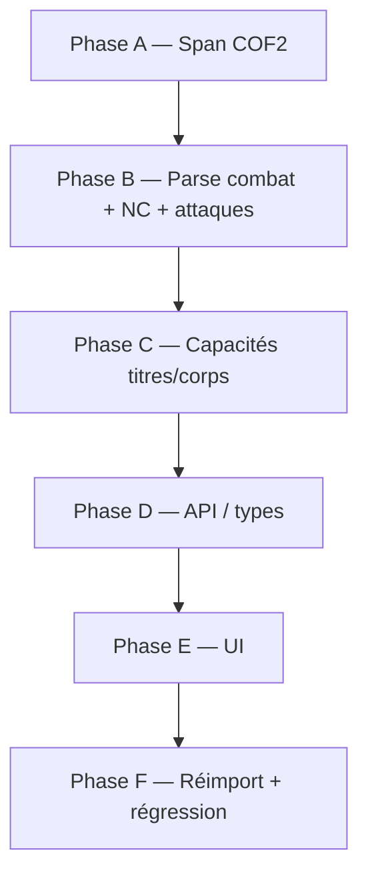

# Plan de correction — fiches COF2 complètes (Croissez et multipliez)

**Date :** 2026-06-29  
**Campagne :** `croissez-et-multipliez`  
**Document :** `doc_940fbddb1034` — `COF2_Croissez_Et_Multipliez.pdf`  
**Fiche de référence :** ORC DE BASE (p. 9)  
**Périmètre :** extraction Clojure → schéma → API → affichage UI ; régression sur les 4 fiches du document et les autres campagnes COF2

---

## 1. État observé

### 1.1 Rendu PDF (référence visuelle)

Fiche **ORC DE BASE** (p. 9, colonne gauche) :

| Zone | Contenu attendu |
|------|-----------------|
| En-tête | `ORC DE BASE \| NC 1/2` |
| Type | `TAILLE MOYENNE` |
| Attributs | AGI +0, CON +2, FOR +2*, PER +0, CHA −2, INT −2, VOL −1 |
| Combat | Défense **13**, Points de vigueur **12**, Initiative **10** |
| Attaque | **Hache ou masse +3** · DM **1d8+2** |
| Capacité | **SENSIBLE À LA LUMIÈRE :** *Créatures souterraines, les orcs détestent la lumière du jour. La lumière du soleil leur inflige un dé malus en attaque.* |

### 1.2 API actuelle (`GET /documents/doc_940fbddb1034/stat-blocks/ORC%20DE%20BASE`)

```json
{
  "name": "ORC DE BASE",
  "nc": 1,
  "attributes": { "AGI": 0, "CON": 2, "FOR": 2, "PER": 0, "CHA": -2, "INT": -2, "VOL": -1 },
  "abilities": [],
  "text": "| NC 1/2 ORC DE BASE\n\nTAILLE MOYENNE\n\n| AGI +0 | ... |\n\n(S)\n\n(V)\n\n(I)\n\nCréatures souterraines, les orcs détestent..."
}
```

| Champ attendu | Extrait ? | Affiché UI ? |
|---------------|-----------|--------------|
| NC `1/2` | ❌ `nc: 1` | ❌ `NC 1` |
| Attributs | ✅ | ✅ |
| Défense 13 | ❌ | ❌ |
| PV 12 | ❌ | ❌ |
| Initiative 10 | ❌ | ❌ |
| Attaque Hache ou masse +3 / DM 1d8+2 | ❌ | ❌ |
| Capacité SENSIBLE À LA LUMIÈRE | ❌ (corps seul dans `text`) | ❌ |

### 1.3 Autres fiches du même document

| Fiche | NC API | Attributs | Capacités API | Texte brut (aperçu) |
|-------|--------|-----------|---------------|---------------------|
| ORC DE BASE | 1 (→ 1/2) | ✅ | 0 | `(S)(V)(I)` sans valeurs ; corps capacité sans titre |
| SERGENT ORC | 3 ✅ | ✅ | 1 | `(S)(V)(I)` sans valeurs ; attaque/critique partielle |
| PANTHÈRE | 2 ✅ | ✅ | 1 | contient `Morsure et Griffes +5 · DM 1d6+2` dans le texte mais non structuré |
| ROGÙN | 2 ✅ | ✅ | 0 | contient `Init. 13 Dague +4 · DM 1d4` dans le texte mais non structuré |

> Le problème est **systémique** : le modèle et le parseur ne couvrent pas les champs combat/attaques, et le span COF2 n'inclut pas tous les blocs de la fiche.

### 1.4 Blocs PDF page 9 — ORC DE BASE (diagnostic bloc par bloc)

Blocs tagués dans le span actuel vs blocs manquants :

| idx | y0 | x0 | Dans span | Contenu | Rôle tagué |
|----:|---:|---:|:---------:|---------|------------|
| 03 | 308 | 42.5 | ✅ | `W` (icône) | icon |
| 04 | 309 | 60.8 | ✅ | `\| NC 1/2 ORC DE BASE` | header |
| 05 | 328 | 53.9 | ✅ | `TAILLE MOYENNE` | body |
| 06 | 340 | 51.0 | ✅ | ligne AGI…VOL | stats |
| 07 | 367 | 51.0 | ✅ | `(S)` | body |
| 08 | 367 | 133.4 | ✅ | `(V)` | body |
| **09** | **368** | **64.4** | **❌** | **`Défense 13`** | — |
| **10** | **368** | **146.7** | **❌** | **`Points de vigueur 12`** | — |
| 11 | 379 | 51.0 | ✅ | `(I)` | body |
| **12** | **380** | **51.0** | **❌** | **`Initiative 10 Hache ou masse +3 · DM 1d8+2`** | — |
| **13** | **413** | **51.0** | **❌** | **`SENSIBLE À LA LUMIÈRE`** (glyphes PDF) | — |
| 14 | 423 | 51.1 | ✅ | corps de la capacité (texte prose) | body |

**Constat :** les marqueurs d'icônes `(S)`, `(V)`, `(I)` sont inclus, mais les **blocs de valeur** adjacents (décalés en x0) et le bloc attaque/initiative sont exclus du span. Le titre de capacité (bloc 13) est absent ; seul le corps (bloc 14) est rattaché.

---

## 2. Diagnostic — causes racines

### P0 — NC fractionnaire tronqué

**Fichiers :** `packages/ingest-clj/src/rpg/ingest/stat_blocks/cof2.clj`, `packages/ingest/src/rpg_ingest/raw/stat_blocks/cof2.py`, `schema.clj`, `rpg_core/models/raw.py`

La regex accepte `1/2` mais la conversion garde le premier entier :

```clojure
(defn- parse-nc-value [raw]
  (Integer/parseInt (re-find #"\d+" (str raw))))
```

`"1/2"` → `"1"` → `nc = 1`. Le schéma Malli/Pydantic impose `nc: int?`, ce qui empêche de stocker `1/2`.

### P0 — Span trop court : blocs combat/attaque/capacité exclus

**Fichier :** `cof2.clj` — `detect-spans-on-pages`, `is-stat-continuation?`, `ends-stat-block?`

Les fiches COF2 utilisent une **grille icône + valeur** :
- `(S)` à x0≈51 + `Défense N` à x0≈64
- `(V)` à x0≈133 + `Points de vigueur N` à x0≈147
- `(I)` + `Initiative N Arme +M · DM …` sur un seul bloc

`is-stat-continuation?` ne reconnaît pas :
- `Défense 13`, `Points de vigueur 12` (libellés français complets)
- les blocs valeur décalés horizontalement par rapport aux marqueurs `(S)/(V)/(I)`
- le bloc mixte initiative + attaque

Résultat : le span se ferme après `(I)` ou saute directement au corps de capacité sans titre.

> Voir aussi le plan Momie p. 15 (`docs/plan-stat-blocks-page15-momie.md`, section P2) : blocs combat éclatés — même famille de bug.

### P0 — Champs combat et attaques absents du modèle

**Fichiers :** `schema.clj`, `types.py`, `serialize.py`, `campaign.models.ts`

`ParsedStatBlock` ne contient que : `name`, `subtitle`, `nc`, `attributes`, `abilities`, `rulebook_reference`, `raw_text`.

`DEF`, `PV`, `Init`, `PM` et les lignes d'attaque ne sont **jamais** extraits en champs structurés, même quand le texte est présent dans le span (ex. Panthère, ROGÙN).

### P1 — Glyphes PDF et encodage de titres

**Fichier :** `text_utils.clj`

- Bloc 12 : séparateur attaque encodé `Åàé` au lieu de `· DM` (PUA / mauvaise fonte ToUnicode).
- Bloc 13 : titre capacité illisible (`ïáêïIÞèá…`) au lieu de `SENSIBLE À LA LUMIÈRE`.

`strip-layout-glyphs` retire les PUA mais ne normalise pas ces substitutions. Le parseur d'abilités (`ability-title-re`, `is-ability-block?`) échoue sur le titre corrompu ; le corps en prose (bloc 14) ne matche pas les heuristiques titre `TITRE :`.

### P1 — Capacités : corps orphelin sans titre

**Fichier :** `cof2.clj` — `parse-abilities-from-inline-text`, `is-ability-body-continuation?`

Le parseur inline cherche des titres **après** `(I) Init.` dans le texte combiné. Ici le texte combiné ne contient que `(I)` (sans valeur Init ni attaque), donc aucune capacité structurée.

Le corps « Créatures souterraines… » est inclus comme bloc `body` mais sans lien vers un titre — il reste dans `raw_text` / `text` du chunk, invisible dans l'UI.

### P2 — UI masque le texte brut quand des stats partielles existent

**Fichier :** `stat-block-viewer.component.ts`

```typescript
const hasStructuredStats =
  block.nc != null ||
  (block.attributes != null && Object.keys(block.attributes).length > 0) ||
  (block.abilities?.length ?? 0) > 0;
return !hasStructuredStats && !!this.bodyText();
```

Dès que NC + attributs sont présents, le fallback `text` est **caché** — l'utilisateur ne voit ni les valeurs manquantes ni le corps de capacité.

### P2 — Pas de section UI pour combat / attaques

**Fichier :** `stat-block-viewer.component.html`

Sections actuelles : en-tête (nom, NC), bannière rulebook, attributs, capacités, texte brut (fallback). Aucun rendu pour défense, PV, initiative, PM, ni liste d'attaques structurées.

---

## 3. Modèle de données cible

Étendre `ParsedStatBlock` (Clojure + Python + API + Angular) :

```json
{
  "name": "ORC DE BASE",
  "nc": "1/2",
  "attributes": { "AGI": 0, "FOR": 2, "CON": 2, "PER": 0, "CHA": -2, "INT": -2, "VOL": -1 },
  "defense": 13,
  "vigor": 12,
  "initiative": 10,
  "mana": null,
  "attacks": [
    {
      "name": "Hache ou masse",
      "attack_bonus": 3,
      "damage": "1d8+2"
    }
  ],
  "abilities": [
    {
      "title": "SENSIBLE À LA LUMIÈRE",
      "text": "Créatures souterraines, les orcs détestent la lumière du jour. La lumière du soleil leur inflige un dé malus en attaque."
    }
  ],
  "game_system": "cof2"
}
```

### Décisions de schéma

| Champ | Type | Notes |
|-------|------|-------|
| `nc` | `string` | Conserver la forme affichée (`"1/2"`, `"4"`, `"1"`) ; rétrocompat : accepter `int` en lecture |
| `defense` | `int?` | Alias accepté : `def` |
| `vigor` | `int?` | Libellé PDF « Points de vigueur » ; alias `pv` |
| `initiative` | `int?` | |
| `mana` | `int?` | PM — optionnel, fréquent sur PNJ |
| `attacks` | `[Attack]` | `name`, `attack_bonus`, `damage` (chaîne libre `1d8+2`) |
| `abilities` | inchangé | Distinction : attaques = ligne arme ; capacités = traits nommés |

---

## 4. Plan de correction

### Phase A — Étendre le span COF2 (bloquant)

**Fichiers :** `cof2.clj`, éventuellement `block_merging.clj`

1. **Reconnaître les blocs valeur combat** dans `is-stat-continuation?` :
   - `(?i)^Défense\s+\d+`
   - `(?i)^Points de vigueur\s+\d+`
   - `(?i)^Initiative\s+\d+`
   - `(?i)^Init\.\s+\d+`
   - Variantes abrégées `DEF`, `PV` (déjà dans `stat-block-body-re`)

2. **Grouper marqueur + valeur** : quand un bloc `(S)`, `(V)` ou `(I)` est dans le span, inclure automatiquement les blocs voisins sur la même ligne (même `y0` ± tolérance, `x0` plus grand) tant qu'ils matchent un libellé combat/attaque.

3. **Inclure le bloc titre de capacité** : tout bloc bold en capitales immédiatement avant un corps `is-ability-body-continuation?`, même si le texte est partiellement corrompu (heuristique positionnelle : entre ligne combat et corps prose).

4. **Ne pas couper le span** sur un bloc `(I)` seul — attendre la ligne initiative+attaque et le titre de capacité suivant.

**Critère de done :** pour ORC DE BASE, `source_refs.page_block_ids` inclut les blocs 09–14 (pas seulement 03–08, 11, 14).

**Test :** `stat_blocks_test.clj` — assertion sur les `block-refs` et le `raw-text` combiné de la fiche ORC p. 9.

---

### Phase B — Parser les champs combat et attaques

**Fichiers :** `cof2.clj`, `cof2.py`, `schema.clj`, `types.py`

1. **NC fractionnaire** — remplacer `parse-nc-value` :

   ```clojure
   (defn- parse-nc-value [raw]
     (let [s (str/trim (str raw))]
       (if (str/includes? s "/")
         s  ; "1/2"
         (Integer/parseInt (re-find #"\d+" s)))))
   ```

   Aligner Python : `NC_RE = r"NC\s*(\d+(?:/\d+)?)"`.

2. **Combat** — nouvelle fonction `parse-combat-stats` sur le texte combiné du span :

   ```clojure
   (def ^:private defense-re #"(?i)(?:\(S\)\s*)?(?:Défense|DEF)\s*(\d+)")
   (def ^:private vigor-re #"(?i)(?:\(V\)\s*)?(?:Points de vigueur|PV)\s*(\d+)")
   (def ^:private initiative-re #"(?i)(?:\(I\)\s*)?(?:Initiative|Init\.?)\s*(\d+)")
   (def ^:private mana-re #"(?i)(?:\(M\)\s*)?PM\s*(\d+)")
   ```

3. **Attaques** — regex dédiée, tolérante aux glyphes :

   ```clojure
   (def ^:private attack-re
     #"(?i)([A-Za-zÀ-ÿ][A-Za-zÀ-ÿ\s\-']+?)\s*\+(\d+)\s*(?:[·\u00b7]|Åàé|DM)\s*(\d+d\d+(?:[+-]\d+)?)")
   ```

   Gérer plusieurs attaques sur une ligne (ROGÙN : dague + attaque magique).

4. **Normalisation glyphes** — étendre `text_utils.clj` :
   - `Åàé`, `·`, `DM` → séparateur canonique ` · DM `
   - conserver une table de substitutions connues COF2 (filigrane `W`, PUA, séparateurs attaque)

**Critère de done :** `parse-span` sur le span ORC retourne `nc "1/2"`, `defense 13`, `vigor 12`, `initiative 10`, une attaque, une capacité.

**Tests :**
- `stat_blocks_test.clj` — cas ORC DE BASE (texte synthétique + PDF réel si disponible)
- `tests/test_stat_blocks_cof2.py` — miroir Python
- `tests/test_cof2_audit_extra_campaigns.py` — enrichir assertions Panthère / Sergent

---

### Phase C — Capacités : titres corrompus et corps orphelins

**Fichier :** `cof2.clj`

1. **Lier corps → titre par proximité** : si un bloc `body` en prose suit un bloc bold court (≤ 60 car., majoritairement majuscules ou glyphes) dans le même span, produire `{:title <titre normalisé ou "Capacité"> :text <corps>}`.

2. **Heuristiques COF2 supplémentaires** dans `ability-body-patterns` :
   - `(?i)lumière du soleil.*dé malus` → titre `SENSIBLE À LA LUMIÈRE`
   - `(?i)15-20 sur le d20` → titre `COUP CRITIQUE` (Sergent Orc)

3. **Fusion pré-parse** (optionnel, si Phase A insuffisante) : dans `block_merging.clj`, fusionner sur une même ligne `(S)` + `Défense N`, `(V)` + `PV N`, et séparer `Initiative N` du reste de la ligne attaque.

**Critère de done :** ORC et SERGENT ORC ont `abilities.length >= 1` avec titre et texte non vides.

---

### Phase D — Propagation API et types

**Fichiers :** `packages/core/src/rpg_core/stat_blocks/serialize.py`, `packages/api/src/rpg_api/schemas.py`, `campaign.models.ts`

1. Étendre `_DETAIL_FIELDS` et `StatBlockIndexOut` si besoin (ex. afficher défense dans la liste).
2. `nc` : type `string | number` côté TS pour la transition.
3. Pas de migration DB : les champs vivent dans `chunks.metadata_json.stat_block` (JSON libre).

**Critère de done :** `GET /stat-blocks/ORC%20DE%20BASE` retourne tous les nouveaux champs.

---

### Phase E — Affichage UI

**Fichiers :** `stat-block-viewer.component.html/.scss/.ts`, `stat-block-list.component.html`

1. **Section « Combat »** entre attributs et capacités :

   ```
   Défense 13  ·  PV 12  ·  Init. 10
   ```

2. **Section « Attaques »** : liste `Nom +N · DM …`.

3. **NC** : afficher la chaîne telle quelle (`NC 1/2`).

4. **Fallback texte** : afficher `text` en complément (section repliable « Texte source ») quand `defense`, `attacks` ou `abilities` attendus sont absents — ou toujours en bas pour debug MJ.

5. **Liste latérale** : badge NC correct (`1/2`).

**Critère de done :** capture Playwright ou manuelle sur `http://127.0.0.1:4200/documents/doc_940fbddb1034` → onglet Fiches → ORC DE BASE montre tous les éléments listés en §1.1.

---

### Phase F — Réimport et non-régression campagnes

1. Réimport Clojure des 5 PDF COF2 :

   ```bash
   # script à créer ou boucle sur les 5 campagnes (aujourd'hui seul clojure-import-momie.sh existe)
   bash .cursor/scripts/clojure-import-momie.sh  # momie
   # + équivalent croissez, faelys, xelys, retour-en-grace
   ```

2. Vérifier les 4 fiches Croissez + échantillon Momie p. 15 (AZULRIA/TALESS) + Panthère Xélys.

3. Exécuter :

   ```bash
   cd packages/ingest-clj && clojure -M:test
   uv run python -m pytest tests/test_stat_blocks_cof2.py tests/test_cof2_audit_extra_campaigns.py tests/test_cof2_audit_stat_blocks.py -q
   ```

---

## 5. Ordre d'implémentation recommandé



| Priorité | Phase | Effort estimé | Impact |
|----------|-------|---------------|--------|
| P0 | A | Moyen | Débloque l'accès au texte combat dans le span |
| P0 | B | Moyen | Corrige NC, DEF, PV, Init, attaques |
| P1 | C | Moyen | Capacités nommées (SENSIBLE À LA LUMIÈRE, etc.) |
| P1 | D | Faible | Exposition données |
| P1 | E | Faible | Visibilité utilisateur |
| P2 | F | Faible | Validation bout en bout |

---

## 6. Critères d'acceptation (ORC DE BASE)

- [ ] `nc` = `"1/2"` (API + UI)
- [ ] `defense` = 13, `vigor` = 12, `initiative` = 10
- [ ] `attacks` contient `{ name: "Hache ou masse", attack_bonus: 3, damage: "1d8+2" }`
- [ ] `abilities` contient `SENSIBLE À LA LUMIÈRE` avec le texte complet
- [ ] Même niveau de complétude pour **SERGENT ORC**, **PANTHÈRE**, **ROGÙN**
- [ ] Pas de régression sur Momie p. 15 (AZULRIA NC 4, TALESS rulebook)
- [ ] Tests Clojure + Python verts

---

## 7. Vérification manuelle

1. Réimport :

   ```bash
   cd packages/ingest-clj
   clojure -M:ingest import \
     --pdf /workspace/data/pdfs/COF2_Croissez_Et_Multipliez.pdf \
     --campaign-id croissez-et-multipliez \
     --campaign-title "Croissez et multipliez" \
     --game-system cof2 \
     --db /workspace/data/rpg_assistant.db
   ```

2. Stack dev :

   ```bash
   bash .cursor/scripts/dev-stack.sh restart
   ```

3. URL : [http://127.0.0.1:4200/documents/doc_940fbddb1034](http://127.0.0.1:4200/documents/doc_940fbddb1034) → onglet **Fiches** → **ORC DE BASE** → comparer avec **Visualisation PDF** p. 9.

4. Capture :

   ```bash
   bash .cursor/scripts/capture-verification.sh doc_940fbddb1034 9
   ```

---

## 8. Fichiers principaux impactés

| Couche | Fichiers |
|--------|----------|
| Extraction Clojure | `stat_blocks/cof2.clj`, `stat_blocks/schema.clj`, `stat_blocks/text_utils.clj`, `block_merging.clj` |
| Extraction Python (parité) | `stat_blocks/cof2.py`, `stat_blocks/types.py` |
| Core / API | `stat_blocks/serialize.py`, `models/raw.py`, `api/schemas.py` |
| Frontend | `stat-block-viewer/*`, `stat-block-list/*`, `campaign.models.ts` |
| Tests | `stat_blocks_test.clj`, `test_stat_blocks_cof2.py`, `test_cof2_audit_extra_campaigns.py` |
| Scripts | Nouveau `clojure-import-all-cof2.sh` (optionnel, QoL) |

---

## 9. Risques et mitigations

| Risque | Mitigation |
|--------|------------|
| Faux positifs sur `Défense N` dans le corps narratif | Limiter au span déjà identifié comme fiche ; ancrer sur `(S)` / position y |
| Titres capacité illisibles (PDFBox) | Heuristiques par contenu du corps + position ; à terme OCR ou mapping police |
| Régression span Momie p. 15 | Tests de non-régression dédiés ; ne pas modifier l'ordre de lecture sans tests |
| `nc` string casse clients | Accepter `int` et `string` en lecture ; sérialiser en string |
| Attaques multi-colonnes (PNJ complexes) | Parser itératif ; tests ROGÙN avec 2 attaques |

---

## 10. Références

- Plan connexe : [`docs/plan-stat-blocks-page15-momie.md`](plan-stat-blocks-page15-momie.md) (span, blocs éclatés, ordre de lecture)
- Audit Croissez : [`docs/audits/comparaison-pdf-ingestion-cof2/RAPPORT_CAMPAGNES_3.md`](audits/comparaison-pdf-ingestion-cof2/RAPPORT_CAMPAGNES_3.md)
- Plan ingestion Clojure : [`docs/plan-clojure-ingestion-full.md`](plan-clojure-ingestion-full.md) (phase 5 — fiches monstre)
