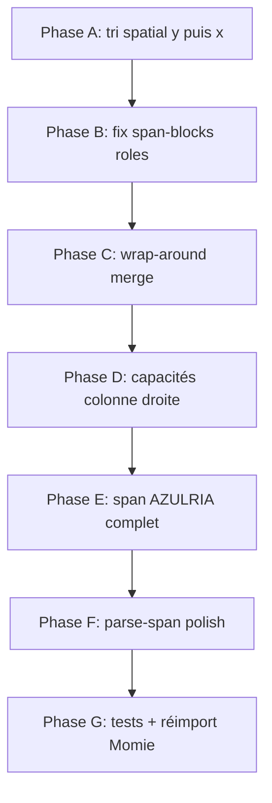

# Plan de correction — fiches page 15 (Momie)

**Date :** 2026-06-28  
**Document :** `doc_a3cfad8c9253` — `COF2_10_Mondanites_Et_Momies_web_v1a.pdf`, page 15  
**Fiches cibles :** AZULRIA (NC 4) et TALESS RHANN  
**Références :** pipeline Python (`packages/ingest/src/rpg_ingest/raw/stat_blocks/cof2.py`), rendu PDF, import Clojure actuel

---

## 1. État observé

### 1.1 Rendu PDF (référence visuelle)

Page 15, colonne gauche (haut → bas) :

| Fiche | Contenu attendu |
|-------|-----------------|
| **AZULRIA** | Icône + `AZULRIA, PRÊTRESSE 7 \| NC 4`, type `HUMAINE`, ligne d'attributs (AGI…VOL), DEF/PV/Init/PM, attaque, voies, équipement |
| **TALESS RHANN** | Icône + nom, renvoi livre de règles (*momie*), texte d'intro talisman, stats complètes, voies, équipement |

Colonnes droite : corps des capacités (TORNADE DE SABLE, MALÉDICTION PROPHÉTIQUE, PASSAGE DANS LA PIERRE, ANIMATION DES MORTS) rattachés à **TALESS**.

### 1.2 Clojure (PDFBox) — état actuel

| Fiche | `chunk_id` | Problème |
|-------|------------|----------|
| **AZULRIA** | `chunk_…_015_128` | Span trop court : en-tête `NC 4` + blocs DEF/PV/Init éclatés. Manque HUMAINE, attributs, voies, équipement, capacités. |
| **TALESS RHANN** | `chunk_…_015_127` | Récupère à tort les stats/voies d'AZULRIA. Titres de capacités sans corps. `ANIMATION DES MORTS` orpheline (colonne droite). |

**Texte AZULRIA actuel :**
```
| NC 4 AZULRIA, PRÊTRESSE 7
DEF 15 (V) PV 56 (I) Init. 11 (M)
```

**Texte TALESS actuel :** header + stats + voies + équipement + 3 titres de capacités vides (`TORNADE DE SABLE :`, etc.).

### 1.3 Python (PyMuPDF) — oracle comportemental

| Fiche | Blocs span | État |
|-------|------------|------|
| **AZULRIA** | 8 | Nom/NC/attributs OK, mais span **trop long** : englobe Masse, voies et équipement qui appartiennent visuellement à TALESS (même colonne, en dessous). |
| **TALESS RHANN** | 4 | Renvoi rulebook OK. 2 capacités avec texte (TORNADE, ANIMATION). Manque MALÉDICTION et PASSAGE (colonne droite / wrap-around). |

> **Objectif** : atteindre la **qualité Python** (minimum), puis corriger les erreurs de frontière AZULRIA/TALESS que les deux pipelines partagent sur cette page difficile.

---

## 2. Diagnostic — causes racines

### P0 — Ordre de lecture des blocs (PDFBox)

**Symptôme :** `detect-spans` parcourt les blocs par **index**, supposé refléter l'ordre de lecture.

**Constat (page 15, après merge Clojure) :**

| Index | y0 | x0 | Contenu | Problème |
|------:|---:|---:|---------|----------|
| 0–2 | 43–291 | 42.5 | Icônes W + TALESS RHANN | Détecté en premier |
| 3–5 | 75–103 | 51.0 | Stats AGI… + PM/Masse/Voies | **Visuellement AZULRIA**, rattaché à TALESS |
| 13 | 44.6 | 60.8 | `\| NC 4 AZULRIA…` | Header AZULRIA **après** TALESS dans l'index |
| 12 | 63.0 | 53.9 | HUMAINE | Orphelin |

**Cause :** `spatial-sort-key` Clojure = `(x0, y0, x1)` (`reading_order.clj`). Les blocs à `x0≈42.5` (icônes, nom TALESS) passent **avant** les blocs à `x0≈51` (stats AZULRIA à y0≈75), alors que visuellement AZULRIA est **au-dessus** de TALESS.

**Référence Python :** `spatial_sort_key` = `(page, y_bucket, x0)` — tri **vertical d'abord**, puis horizontal.

```
Clojure (x0, y0) :  W₀, W₁, TALESS, stats, …, AZULRIA   ← faux
Python  (y, x0)  :  AZULRIA, HUMAINE, stats, …, TALESS   ← correct
```

### P0 — Métadonnées `stat-block-role` absentes dans `span-blocks`

**Fichier :** `stat_blocks/cof2.clj`, boucle `detect-spans-on-pages`

Lors de l'extension d'un span, les blocs sont ajoutés via :
```clojure
(conj span-blocks (with-page-number block page-num))
```
sans le rôle tagué. Or `tag-block` ne met à jour que `pages`, pas les copies dans `span-blocks`.

**Impact :** `is-ability-body-continuation?` teste `(get-in previous [:metadata :stat-block-role])` → toujours `nil` → les corps de capacités (blocs 9–11) ne sont **jamais** rattachés aux titres (blocs 6–8).

Même problème pour la branche `is-stat-continuation?` qui s'appuie sur le rôle du bloc courant.

### P1 — Fusion wrap-around absente (Clojure)

**Python :** `block_merging.py` → `_is_wrap_around_pair` fusionne un titre de capacité en bas de colonne gauche avec sa suite en haut de colonne droite.

**Test de régression :** `test_wrap_around_merge_page_15_stat_block` — `PASSAGE DANS LA PIERRE` + `directions. Elle peut emmener…`

**Clojure :** `block_merging.clj` ne porte que spread-titles et meta-box. Bloc 28 (`directions. Elle peut…`, x0≈260) reste orphelin.

### P1 — Capacités multi-colonnes non rattachées

Blocs orphelins page 15 (hors span) :

| Index | Contenu | Colonne |
|------:|---------|---------|
| 9–11 | Corps TORNADE / MALÉDICTION / PASSAGE | gauche (sous les titres) |
| 26–27 | ANIMATION DES MORTS + corps | droite (y0≈76) |
| 28 | Suite PASSAGE (wrap-around) | droite (y0≈46) |

`ability-blocks-in-reading-order` ne peut pas récupérer des blocs **non taggés** dans le span.

### P2 — Extraction PDFBox : blocs combat éclatés

DEF, `(V)`, PV, `(I)`, Init, `(M)` = 6 blocs séparés (glyphes icônes). À fusionner ou traiter comme un seul bloc `stats` pour le parsing.

### P2 — `parse-span` : écarts mineurs vs Python

| Point | Python | Clojure |
|-------|--------|---------|
| Heuristiques par bloc | toutes les heuristiques essayées | `(first parse-ability-heuristics)` seulement |
| Skip `(I) Init.` inline | `init_match.end()` | `(count init-match)` — off-by-one |
| Attaque / voies | restent dans `raw_text` | parfois classés `ability` avec titre erroné (`Masse +9`) |

### P3 — Limites structurelles (hors bug pur)

Même Python confond les frontières AZULRIA/TALESS sur cette page : le span AZULRIA descend trop bas dans la colonne gauche. Une amélioration cible serait de **couper le span** dès qu'un nouveau header icône+nom est détecté (TALESS), indépendamment de l'ordre d'index.

---

## 3. Plan de correction

### Phase A — Ordre de lecture (bloquant)

**Fichiers :** `reading_order.clj`, éventuellement `block_merging.clj` / `pipeline.clj`

1. Aligner `spatial-sort-key` sur Python : `(y_bucket, x0)` avec tolérance verticale (`SPATIAL_Y_TOLERANCE` ≈ 5–10 pt), pas `(x0, y0)`.
2. Vérifier `normalize-page-blocks` appelé **après** chaque merge et **avant** `annotate-stat-blocks`.
3. Option complémentaire pour pages 2 colonnes : tri **column-major** `(colonne, y0, x0)` avant `detect-spans` uniquement (comme `column_major_sort_key` Python), si le tri y/x0 seul ne suffit pas pour les capacités droite.

**Critère :** sur page 15, l'index du premier bloc AZULRIA < index du premier bloc TALESS ; HUMAINE (y0=63) entre header AZULRIA et stats.

**Test :**
```clojure
;; stat_blocks_test.clj
(is (< (index-of "AZULRIA" blocks) (index-of "TALESS RHANN" blocks)))
```

---

### Phase B — Bug `span-blocks` / continuation (bloquant)

**Fichier :** `stat_blocks/cof2.clj`

1. Lors de `conj` dans `span-blocks`, stocker le bloc **avec** `stat-block-role` :
   ```clojure
   (conj span-blocks (-> block
                         (with-page-number page-num)
                         (assoc-in [:metadata :stat-block-role] role)))
   ```
   ou lire le rôle depuis `pages` après `tag-block`.

2. Re-tester `is-ability-body-continuation?` : blocs 9–11 doivent rejoindre le span TALESS.

3. Étendre la continuation aux corps > 120 caractères quand le bloc précédent du span a le rôle `ability` (garde-fou explicite avant le `break` final).

**Critère :** corps des 3 capacités gauche présents dans `raw_text` TALESS ; `abilities[].text` non vide pour TORNADE et MALÉDICTION.

**Test :** port de `test_cof2_parse_taless_abilities` (4 capacités + rulebook `momie`) sur fixtures synthétiques **et** assertion sur PDF réel page 15.

---

### Phase C — Fusion wrap-around (important)

**Fichier :** `block_merging.clj` (+ tests)

1. Porter `_is_wrap_around_pair`, `_wrap_around_continues` depuis `block_merging.py`.
2. Intégrer dans `merge-page-blocks` **avant** le tri spatial final.
3. Ajouter `wrap-around-merge-page-15-stat-block` dans `block_merging_test.clj` (données du test Python).

**Critère :** bloc unique contenant `dans toutes les directions` pour PASSAGE DANS LA PIERRE.

---

### Phase D — Rattachement capacités colonne droite (important)

**Fichier :** `stat_blocks/cof2.clj`

1. Après correction ordre + wrap-around, vérifier que `ANIMATION DES MORTS` (colonne droite, y0≈76) est dans le span TALESS :
   - si encore orphelin : assouplir `ends-stat-block?` quand des blocs `ability` non réclamés existent **dans la même colonne droite** au-dessus ;
   - ou post-passe : rattacher à TALESS les blocs `ability` de la colonne droite entre y0 min/max du span.

2. Réutiliser `ability-blocks-in-reading-order` + `column-side` déjà présents.

**Critère :** TALESS a 4 capacités avec texte (comme Python) : TORNADE, MALÉDICTION, PASSAGE, ANIMATION.

---

### Phase E — Span AZULRIA complet (important)

Une fois phases A–B appliquées :

1. Vérifier span AZULRIA = header + HUMAINE + stats + DEF/PV/Init/PM + attaque + voies + équipement.
2. Le span doit **s'arrêter** au header TALESS (icône + nom), pas embarquer voies/équipement de TALESS.

**Actions si incomplet :**
- fusionner blocs DEF/PV/Init adjacents (même bande y, x proches) ;
- traiter `HUMAINE` comme `body` (déjà prévu dans `is-stat-continuation?`) ;
- si header AZULRIA = `\| NC 4 NAME` sans icône séparée, ne pas consommer les icônes W du haut pour TALESS (buffer `pending-icons` conditionné par proximité y du prochain header).

**Critère AZULRIA (aligné Python minimum) :**
```
name=AZULRIA, subtitle=PRÊTRESSE 7, nc=4
attributes: AGI +1, CON +2, FOR +1, PER +0, CHA +0, INT +0, VOL +3
raw_text contient: HUMAINE, DEF, PV, Init, Masse, Voie de, Équipement
```

**Critère AZULRIA n'inclut pas :** `Voir le profil de momie`, `TALESS RHANN`.

---

### Phase F — `parse-span` (polish)

**Fichier :** `stat_blocks/cof2.clj`

1. Aligner boucle heuristiques sur Python : essayer **toutes** les `parse-ability-heuristics`, pas seulement `first`.
2. Corriger skip `(I) Init.` : utiliser position de fin du match (`re-matcher` + `.end()`).
3. Ne pas promouvoir `Masse +9` / `Équipement :` en entrées `abilities[]` si le bloc a le rôle `body` (filtrer titres sans `:` en fin de ligne ALL_CAPS ou exclure motifs `^Masse` / `^Équipement`).

---

### Phase G — Tests et non-régression

| Test | Source Python | Fichier Clojure |
|------|---------------|-----------------|
| Attributs + NC AZULRIA | `test_cof2_parse_attributes_and_nc` | `stat_blocks_test.clj` |
| 4 capacités TALESS + rulebook | `test_cof2_parse_taless_abilities` | `stat_blocks_test.clj` |
| PER/VOL ligne séparée | `test_cof2_parse_per_and_vol_separately` | `stat_blocks_test.clj` |
| Wrap-around page 15 | `test_wrap_around_merge_page_15_stat_block` | `block_merging_test.clj` |
| PDF réel page 15 | `real_pdf_benchmark._mondanites_page15_stat_blocks` | enrichir `detect-spans-on-mondanites-page-15` |

**Benchmark page 15 (nouveau) :**
```clojure
;; AZULRIA
(is (= "AZULRIA" (:name azulria)))
(is (= 4 (:nc azulria)))
(is (pos? (count (:attributes azulria))))
(is (re-find #"HUMAINE" (:raw-text azulria)))

;; TALESS
(is (= "TALESS RHANN" (:name taless)))
(is (= "momie" (get-in taless [:rulebook-reference :profile-name])))
(is (= 4 (count (:abilities taless))))
(is (every? #(seq (:text %)) (:abilities taless)))
```

---

## 4. Ordre d'implémentation recommandé



| Priorité | Phase | Effort estimé | Impact |
|----------|-------|---------------|--------|
| P0 | A + B | modéré | corrige l'inversion AZULRIA/TALESS + corps de capacités vides |
| P1 | C + D | modéré | PASSAGE + ANIMATION DES MORTS |
| P1 | E | faible–modéré | fiche AZULRIA complète |
| P2 | F + G | faible | qualité metadata API/MCP |

---

## 5. Validation finale

1. Réimport :
   ```bash
   bash .cursor/scripts/clojure-import-momie.sh
   ```
2. Tests :
   ```bash
   cd packages/ingest-clj && clojure -M:test
   uv run python -m pytest tests/test_stat_blocks_cof2.py tests/test_block_merging.py -q
   ```
3. API :
   ```bash
   curl -s http://127.0.0.1:8000/documents/{document_id}/stat-blocks | jq
   curl -s http://127.0.0.1:8000/documents/{document_id}/stat-blocks/AZULRIA | jq '.abilities,.attributes,.text'
   curl -s http://127.0.0.1:8000/documents/{document_id}/stat-blocks/TALESS%20RHANN | jq '.abilities,.rulebook_reference'
   ```
4. Vérification visuelle : page 15, visualiseur PDF — 2 chunks `stat_block`, bbox couvrant chaque fiche entière.

---

## 6. Hors scope (suivi ultérieur)

- Corriger la **frontière AZULRIA/TALESS** dans Python (span AZULRIA trop long) — amélioration commune aux deux pipelines.
- Détection de fiches sur les **autres pages** Momie (seulement 2 spans aujourd'hui sur tout le PDF).
- Phase 6 plan global : exposition MCP/API sémantique.

---

**Dernière mise à jour :** 2026-06-28
